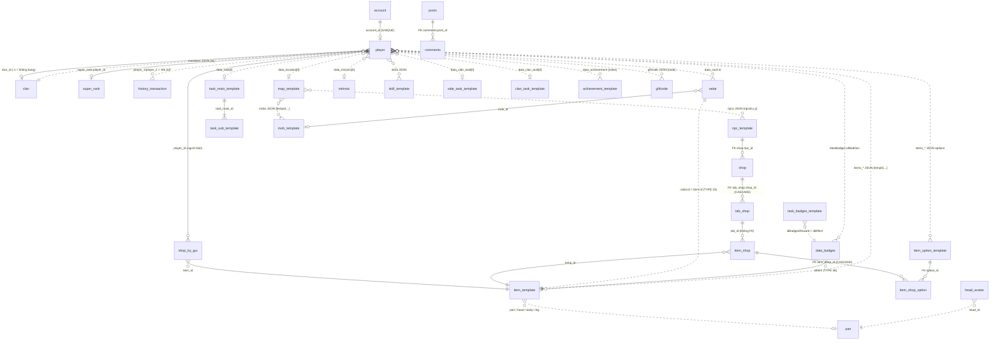

# 02. Đặc tả Database – Ngọc Rồng Online (Teamobi2026)

> Tài liệu mô tả chi tiết **41 bảng** trong dump `database team2026.sql` (phpMyAdmin 5.2.1, MariaDB 10.4.32, tạo ngày 22/05/2026, database `team2026`).
> Mọi thông tin lấy từ dump SQL và mã nguồn `SRC/src/nro/models/**`; số dòng trích dẫn tính theo file hiện tại. Phần ý nghĩa cột **suy ra từ code đọc/ghi cột đó**; với cột/bảng không có code Java sử dụng thì ghi rõ "không dùng trong Java" và ý nghĩa chỉ là suy đoán theo tên.
> Dữ liệu template chi tiết (option, item, skill, map, mob, npc, nội tại, rada, shop...) xem [02b-database-du-lieu-template.md](02b-database-du-lieu-template.md).
> Giá trị nhạy cảm (mật khẩu, API key, mã thẻ...) trong dữ liệu mẫu đã được thay bằng `***(ẩn)***`.

## Mục lục

1. [Tổng quan & kết nối](#1-tổng-quan--kết-nối)
2. [Danh sách 41 bảng](#2-danh-sách-41-bảng)
3. [Sơ đồ quan hệ (ER)](#3-sơ-đồ-quan-hệ-er)
4. [Cấu trúc JSON các cột bảng player](#4-cấu-trúc-json-các-cột-bảng-player)
5. [Chi tiết từng bảng](#5-chi-tiết-từng-bảng)

   - **Tài khoản & nhân vật**: [`account`](#account), [`player`](#player), [`super_rank`](#super_rank), [`clan`](#clan), [`shop_ky_gui`](#shop_ky_gui), [`history_transaction`](#history_transaction)
   - **Template game**: [`item_template`](#item_template), [`item_option_template`](#item_option_template), [`skill_template`](#skill_template), [`intrinsic`](#intrinsic), [`map_template`](#map_template), [`mob_template`](#mob_template), [`npc_template`](#npc_template), [`radar`](#radar), [`part`](#part), [`head_avatar`](#head_avatar), [`bg_item_template`](#bg_item_template), [`array_head_2_frames`](#array_head_2_frames), [`img_by_name`](#img_by_name), [`flag_bag`](#flag_bag), [`data_badges`](#data_badges), [`task_badges_template`](#task_badges_template), [`achievement_template`](#achievement_template), [`task_main_template`](#task_main_template), [`task_sub_template`](#task_sub_template), [`side_task_template`](#side_task_template), [`clan_task_template`](#clan_task_template)
   - **Shop, giftcode, thông báo**: [`shop`](#shop), [`tab_shop`](#tab_shop), [`item_shop`](#item_shop), [`item_shop_option`](#item_shop_option), [`giftcode`](#giftcode), [`notify`](#notify)
   - **Website / nạp tiền**: [`adminpanel`](#adminpanel), [`settings`](#settings), [`napthe`](#napthe), [`payments`](#payments), [`bank_transfers`](#bank_transfers), [`posts`](#posts), [`comments`](#comments), [`phongchat`](#phongchat)
6. [So sánh với SRC/sql/nro1.sql](#6-so-sánh-với-srcsqlnro1sql)
7. [Danh sách key trong bảng settings](#7-danh-sách-key-trong-bảng-settings)
8. [Ghi chú / điểm cần lưu ý](#8-ghi-chú--điểm-cần-lưu-ý)

---

## 1. Tổng quan & kết nối

| Mục | Giá trị | Nguồn |
|---|---|---|
| DBMS | MariaDB 10.4.32 (dump bằng phpMyAdmin 5.2.1) | header `database team2026.sql` |
| Tên database | `team2026` | `SRC/Config.properties` (`database.name`), header dump |
| Driver / URL | `com.mysql.jdbc.Driver`, `jdbc:mysql://host:port/db?useUnicode=yes&characterEncoding=UTF-8` | `Config.properties`; `nro/models/data/LocalManager.java` `createConfig()` dòng ~178 |
| Connection pool | HikariCP; `database.min`/`database.max` (hiện 1/1), `database.lifetime` 120000 ms; cache prepared statement 250 | `LocalManager.loadProperties()` dòng 58–97, `createConfig()` |
| API truy vấn | `LocalManager.executeQuery(sql, params...)`, `executeUpdate(sql, params...)`; đặc biệt câu `insert ... values ()` sẽ tự sinh `(?,?,...)` theo số tham số | `LocalManager.java` dòng 122–176 |
| Engine | Tất cả InnoDB, `ROW_FORMAT=DYNAMIC` | dump |
| Charset | Đa số `utf8mb4_general_ci`; ngoại lệ ghi ở bảng mục 2 | dump |
| Nạp template | Toàn bộ template nạp 1 lần vào RAM khi khởi động: `Manager.loadDatabase()` (`nro/models/server/Manager.java` dòng 288–975) | |
| Nhân vật | Load: `MrBlue.loadPlayer()`; Save: `PlayerDAO.updatePlayer()` | `nro/models/database/` |

**Nhóm bảng:**

- **Tài khoản & nhân vật** (dữ liệu động, server đọc/ghi): `account`, `player`, `super_rank`, `clan`, `shop_ky_gui`, `history_transaction`.
- **Template game** (chỉ đọc khi khởi động): item, option, skill, map, mob, npc, intrinsic, radar, part, nhiệm vụ, thành tựu, danh hiệu...
- **Shop, giftcode, thông báo**: `shop`, `tab_shop`, `item_shop`, `item_shop_option`, `giftcode` (server ghi `count_left`), `notify`.
- **Website / nạp tiền** (không có code Java sử dụng): `adminpanel`, `settings`, `napthe`, `payments`, `bank_transfers`, `posts`, `comments`, `phongchat`.

> Ngoài ra `nro/models/database/EventDAO.java` truy vấn bảng **`event`** (`SELECT data FROM event WHERE name = 'international_womens_day'`, dòng 31, 55) – **bảng này không tồn tại trong dump** (xem Ghi chú).

## 2. Danh sách 41 bảng

| Bảng | Nhóm | Số cột | Charset/Collation | Khóa chính | AUTO_INCREMENT kế tiếp | Số dòng INSERT trong dump |
|---|---|---|---|---|---|---|
| [`account`](#account) | Tài khoản & nhân vật | 35 | utf8mb4/utf8mb4_general_ci | id | 3731 | 3 |
| [`player`](#player) | Tài khoản & nhân vật | 70 | utf8mb4/utf8mb4_general_ci | id | 1368 | 1 |
| [`super_rank`](#super_rank) | Tài khoản & nhân vật | 11 | utf8mb4/utf8mb4_unicode_ci | id | 1348 | 1346 |
| [`clan`](#clan) | Tài khoản & nhân vật | 14 | utf8mb4/utf8mb4_general_ci | id | – | 1 |
| [`shop_ky_gui`](#shop_ky_gui) | Tài khoản & nhân vật | 10 | utf8/utf8_general_ci | id | – | 3 |
| [`history_transaction`](#history_transaction) | Tài khoản & nhân vật | 10 | utf8mb4/utf8mb4_general_ci | id | 1026 | 0 |
| [`item_template`](#item_template) | Template game | 15 | utf8mb4/utf8mb4_general_ci | id | – | 2000 |
| [`item_option_template`](#item_option_template) | Template game | 2 | utf8mb4/utf8mb4_general_ci | id | – | 251 |
| [`skill_template`](#skill_template) | Template game | 10 | utf8mb4/utf8mb4_general_ci | nclass_id,id | – | 27 |
| [`intrinsic`](#intrinsic) | Template game | 8 | utf8mb4/utf8mb4_general_ci | **không có** | – | 208 |
| [`map_template`](#map_template) | Template game | 14 | utf8mb4/utf8mb4_general_ci | id | – | 169 |
| [`mob_template`](#mob_template) | Template game | 9 | utf8mb4/utf8mb4_general_ci | id | – | 119 |
| [`npc_template`](#npc_template) | Template game | 6 | utf8mb4/utf8mb4_general_ci | id | – | 93 |
| [`radar`](#radar) | Template game | 13 | utf8mb4/utf8mb4_unicode_ci | **không có** | – | 21 |
| [`part`](#part) | Template game | 3 | utf8mb4/utf8mb4_general_ci | **không có** | – | 2099 |
| [`head_avatar`](#head_avatar) | Template game | 2 | utf8mb4/utf8mb4_general_ci | head_id | – | 495 |
| [`bg_item_template`](#bg_item_template) | Template game | 5 | utf8mb4/utf8mb4_general_ci | id | – | 597 |
| [`array_head_2_frames`](#array_head_2_frames) | Template game | 2 | utf8mb4/utf8mb4_general_ci | id | – | 52 |
| [`img_by_name`](#img_by_name) | Template game | 3 | utf8mb4/utf8mb4_general_ci | id | 148 | 146 |
| [`flag_bag`](#flag_bag) | Template game | 6 | utf8mb4/utf8mb4_general_ci | id | – | 156 |
| [`data_badges`](#data_badges) | Template game | 5 | latin1/latin1_swedish_ci | id | 223 | 16 |
| [`task_badges_template`](#task_badges_template) | Template game | 4 | latin1/latin1_swedish_ci | id | 19 | 18 |
| [`achievement_template`](#achievement_template) | Template game | 5 | utf8mb4/utf8mb4_unicode_ci | id | 21 | 20 |
| [`task_main_template`](#task_main_template) | Template game | 3 | utf8mb4/utf8mb4_general_ci | id | – | 30 |
| [`task_sub_template`](#task_sub_template) | Template game | 7 | utf8mb4/utf8mb4_general_ci | ducvupro | 164 | 125 |
| [`side_task_template`](#side_task_template) | Template game | 7 | utf8mb4/utf8mb4_general_ci | id | – | 59 |
| [`clan_task_template`](#clan_task_template) | Template game | 7 | utf8mb4/utf8mb4_general_ci | id | – | 59 |
| [`shop`](#shop) | Shop, giftcode, thông báo | 4 | utf8mb4/utf8mb4_general_ci | id | 37 | 32 |
| [`tab_shop`](#tab_shop) | Shop, giftcode, thông báo | 3 | utf8mb4/utf8mb4_general_ci | id | 64 | 58 |
| [`item_shop`](#item_shop) | Shop, giftcode, thông báo | 9 | utf8mb4/utf8mb4_general_ci | id | 999 | 826 |
| [`item_shop_option`](#item_shop_option) | Shop, giftcode, thông báo | 4 | utf8mb4/utf8mb4_general_ci | id | 1801 | 1420 |
| [`giftcode`](#giftcode) | Shop, giftcode, thông báo | 6 | latin1/latin1_swedish_ci | id | 1262 | 1 |
| [`notify`](#notify) | Shop, giftcode, thông báo | 3 | latin1/latin1_swedish_ci | id | 3 | 0 |
| [`adminpanel`](#adminpanel) | Website / nạp tiền | 19 | utf8mb4/utf8mb4_general_ci | **không có** | – | 1 |
| [`settings`](#settings) | Website / nạp tiền | 18 | utf8mb4/utf8mb4_general_ci | **không có** | – | 1 |
| [`napthe`](#napthe) | Website / nạp tiền | 9 | utf8mb4/utf8mb4_general_ci | id | 2 | 1 |
| [`payments`](#payments) | Website / nạp tiền | 16 | utf8mb4/utf8mb4_general_ci | id | 19 | 4 |
| [`bank_transfers`](#bank_transfers) | Website / nạp tiền | 9 | utf8mb4/utf8mb4_general_ci | id | 17 | 0 |
| [`posts`](#posts) | Website / nạp tiền | 11 | utf8mb4/utf8mb4_general_ci | id | 91 | 8 |
| [`comments`](#comments) | Website / nạp tiền | 10 | utf8mb4/utf8mb4_general_ci | id | 17 | 1 |
| [`phongchat`](#phongchat) | Website / nạp tiền | 4 | utf8mb4/utf8mb4_general_ci | id | 282 | 0 |

Tổng số dòng dữ liệu: **10467**. Bảng không có dữ liệu: `bank_transfers`, `history_transaction`, `notify`, `phongchat`.

## 3. Sơ đồ quan hệ (ER)

Database chỉ khai báo **5 ràng buộc khóa ngoại thật trên 4 bảng** (`comments.post_id`, `item_shop_option.item_shop_id`, `item_shop_option.option_id`, `shop.npc_id`, `tab_shop.shop_id`). Các quan hệ còn lại là **quan hệ logic** do code tự đảm bảo (nhiều quan hệ nằm bên trong chuỗi JSON). Trong sơ đồ: đường liền `--` = FK thật hoặc cột id rõ ràng; đường đứt `..` = tham chiếu nằm trong JSON / chuỗi / suy luận.

Các bảng độc lập (không liên kết trong code Java): `adminpanel`, `settings`, `napthe`, `payments`, `bank_transfers`, `phongchat`, `notify`, `flag_bag`, `bg_item_template`, `array_head_2_frames`, `img_by_name`.

## 4. Cấu trúc JSON các cột bảng `player`

Quy ước chung:

- Nguồn đọc: `SRC/src/nro/models/database/MrBlue.java` – hàm `loadPlayer()` (dòng 175–1335). Nguồn ghi: `SRC/src/nro/models/database/PlayerDAO.java` – `updatePlayer()` (dòng 352–1063); giá trị khởi tạo: `createNewPlayer()` (dòng 37–350).
- `[i]` = phần tử thứ i (bắt đầu từ 0). "ms" = epoch millisecond (`System.currentTimeMillis()`).
- Nhiều cột được **mã hóa JSON 2–3 lớp**: phần tử của mảng ngoài là *chuỗi* chứa JSON (vì code gọi `toJSONString()` rồi `add()` chuỗi đó vào mảng cha). Khi đọc, code `JSONValue.parse(String.valueOf(...))` từng lớp.
- Nhiều khối đọc được bọc `try/catch` và gán giá trị mặc định khi lỗi → dữ liệu sai định dạng **không làm hỏng login** nhưng bị reset âm thầm.

### 4.1 `data_inventory` – tiền tệ

| Index | Ý nghĩa | Kiểu khi đọc | Ghi chú |
|---|---|---|---|
| [0] | Vàng (`inventory.gold`) | long | Khi lưu bị chặn ở `Inventory.LIMIT_GOLD` = 200.000.000.000 |
| [1] | Ngọc xanh (`inventory.gem`) | int | Tạo mới: 10.000 (hoặc 1.000.000.000 nếu `Manager.TEST`) |
| [2] | Hồng ngọc (`inventory.ruby`) | int | |
| [3] | Điểm/coupon (`inventory.coupon`) | int | |
| [4] | Điểm event (`inventory.event`) | – | **Có ghi nhưng không đọc** (`if (dataArray.size() >= 5 && false)`, dòng 231) → luôn = 0 sau khi load |

Mẫu: `[1864097696,705670,60008,1000,0]`. Tạo mới: `[2000, 10000, 0, 0, 0]`. Cột này cũng được `SuperRankDAO.updatePlayer()` ghi riêng.

### 4.2 `data_location` – vị trí

| Index | Ý nghĩa |
|---|---|
| [0] | mapId (khi lưu dùng `player.mapIdBeforeLogout`) |
| [1] | x |
| [2] | y |

Quy tắc khi **lưu** (`updatePlayer` dòng 368–391): nhân vật chết → về nhà (`mapId = gender + 21`, x=300, y=336) và HP/KI = 1; đang ở Doanh trại / NRSĐ / map không vào được → về nhà.
Quy tắc khi **load** (dòng 268–297): map 51, Doanh trại, NRSĐ, Siêu thần thủy, Mabư 2H → về nhà; map Mabư khi chưa mở → về nhà; map 112 → y=408; map 113/129 → y=360; map 49 → map 45 (359, 408). Tạo mới: `[39 + gender, 100, 384]`.

### 4.3 `data_point` – chỉ số

| Index | Ý nghĩa | Field | Kiểu đọc |
|---|---|---|---|
| [0] | Giới hạn sức mạnh (cấp mở giới hạn) | `nPoint.limitPower` | byte |
| [1] | Sức mạnh | `nPoint.power` | long |
| [2] | Tiềm năng | `nPoint.tiemNang` | long |
| [3] | Thể lực | `nPoint.stamina` | short |
| [4] | Thể lực tối đa | `nPoint.maxStamina` | short |
| [5] | HP gốc | `nPoint.hpg` | int |
| [6] | KI gốc | `nPoint.mpg` | int |
| [7] | Sức đánh gốc | `nPoint.dameg` | int |
| [8] | Giáp gốc | `nPoint.defg` | int |
| [9] | Chí mạng gốc | `nPoint.critg` | byte |
| [10] | Chí mạng dragon | `nPoint.critdragon` | byte |
| [11] | "Năng động" – luôn ghi `0`, khi đọc bị bỏ qua | – | – |
| [12] | HP hiện tại | `nPoint.hp` | **int** (ghi từ long) |
| [13] | KI hiện tại | `nPoint.mp` | **int** (ghi từ long) |

Tạo mới (dòng 54–67): `[0, 2000, 2000, 1000, 1000, hp, ki, sđ, 0, 0, 0, 0, hp, ki]` với HP gốc 200 (TĐ) / 100, KI gốc 200 (NM) / 100, sức đánh 15 (XD) / 10.

### 4.4 `data_magic_tree` – cây đậu thần

| Index | Ý nghĩa |
|---|---|
| [0] | Cấp cây (byte) |
| [1] | Số đậu hiện có (byte) |
| [2] | Đang nâng cấp: 1/0 |
| [3] | lastTimeHarvest (ms) |
| [4] | lastTimeUpgrade (ms) |

Tạo mới: `[1, 5, 0, now, now]`.

### 4.5 Các cột vật phẩm: `items_body`, `items_bag`, `items_box`, `items_box_lucky_round`, `items_daban`

Cấu trúc chung – mảng các **chuỗi**, mỗi chuỗi là một mảng 4 phần tử:

| Index | Ý nghĩa |
|---|---|
| [0] | `template.id` (id `item_template`), `-1` = ô trống |
| [1] | Số lượng (`quantity`) |
| [2] | **Chuỗi** JSON danh sách option; mỗi option lại là chuỗi `"[optionId,param]"` |
| [3] | `createTime` (ms) – dùng tính hạn sử dụng (option 93) |

Ví dụ thực tế (dump): `"[0,1,\"[\\\"[47,2]\\\"]\",1757079582056]"` = Áo vải 3 lỗ x1, option 47 (Giáp+2). Ô trống: `"[-1,0,\"[]\",1779441784043]"`.

| Cột | Số ô khi tạo mới | Ghi chú khi load (`MrBlue.loadPlayer`) |
|---|---|---|
| `items_body` | 11 (ô 0 áo idAo 0/1/2 + option 47; ô 1 quần 6/7/8 + option 6) | Nếu chỉ có 10 phần tử thì thêm 1 ô trống (dòng 370). Item hết hạn (`ItemService.isOutOfDateTime`) → thành ô trống. Ý nghĩa ô theo `InventoryService.putItemBody()`: 0 áo, 1 quần, 2 găng, 3 giày, 4 rada/nhẫn, 5 cải trang, 6 giáp tập luyện (type 32), 7 type 27, 8 đeo lưng (type 11), 9 thú cưỡi (type 23/24), 10 type 25 |
| `items_bag` | 30 (ô 0: Đậu thần cấp 5 – id 63, x10, option `[2,8]`) | Hết hạn → ô trống |
| `items_box` | 30 (ô 0: Rada cấp 1 – id 12, option `[14,1]`) | Item id 2132 tạo trong 15–28/03/2024 bị thu hồi (dòng 415–428); hết hạn → ô trống |
| `items_box_lucky_round` | 110 ô trống | Chỉ thêm item khác −1 vào `itemsBoxCrackBall`; **không đọc createTime** |
| `items_daban` | 110 ô trống | Đọc tối đa 20 phần tử; bỏ ô trống và item hết hạn; item 2322 tạo trong 06/02–28/06/2025 bị thu hồi |

> Comment trong `createNewPlayer()` (dòng 78–84) mô tả dạng object `{"temp_id", "option", "create_time"}` nhưng code thực tế dùng **mảng** như bảng trên.

### 4.6 `friends`, `enemies`

Mảng các chuỗi `"[id, name, head, body, leg, bag, power]"` (dòng 496–531 / 552–579). Tạo mới: `[]`.

### 4.7 `data_intrinsic` – nội tại

| Index | Ý nghĩa |
|---|---|
| [0] | Id nội tại (`intrinsic.id`, byte) |
| [1] | param1 (short) |
| [2] | param2 (short) |
| [3] | Số lần mở nội tại (`countOpen`) |
| [4] | `effectSkill.isIntrinsic` (boolean) – chỉ đọc nếu size > 4 |
| [5] | `effectSkill.skillID` |
| [6] | `effectSkill.cooldown` |
| [7] | `effectSkill.lastTimeUseSkill` (ms) |

Tạo mới: `[0,0,0,0,0,0,0,0]` (phần tử [4] là số 0 thay vì boolean → `Boolean.parseBoolean("0")` = false).

### 4.8 `data_item_time` – thời gian còn lại của vật phẩm buff

Giá trị lưu là **thời gian còn lại (ms)** (trừ TDLT và RX lưu **phút**). Khi load, code tính ngược `lastTime = now - (TIME_x - còn_lại)` và bật cờ `isUseX = (giá trị != 0)`.

> **Thứ tự GHI và ĐỌC không khớp từ index 12** – xem bảng. Đây là lỗi thực sự: sau mỗi lần logout/login, thời gian buff từ index 12 trở đi bị gán nhầm sang item khác.

| Index | GHI – `PlayerDAO.updatePlayer()` (dòng 595–627) | ĐỌC – `MrBlue.loadPlayer()` (dòng 552–640) |
|---|---|---|
| [0] | Bổ huyết | Bổ huyết |
| [1] | Bổ huyết 2 | Bổ huyết 2 |
| [2] | Bổ khí | Bổ khí |
| [3] | Bổ khí 2 | Bổ khí 2 |
| [4] | Giáp Xên | Giáp Xên |
| [5] | Giáp Xên 2 | Giáp Xên 2 |
| [6] | Cuồng nộ | Cuồng nộ |
| [7] | Cuồng nộ 2 | Cuồng nộ 2 |
| [8] | Ẩn danh | Ẩn danh |
| [9] | Ẩn danh 2 | Ẩn danh 2 |
| [10] | Mở giới hạn sức mạnh (`TIME_OPEN_POWER`) | Mở giới hạn sức mạnh |
| [11] | Máy dò (`TIME_MAY_DO`) | Máy dò |
| [12] | Cỏ bốn lá (`TIME_CO_BON_LA`) | Kho báu x2 |
| [13] | Kho báu x2 | *(bỏ qua)* |
| [14] | Bùa Santa | Thức ăn (meal) |
| [15] | Thức ăn (meal) | Icon thức ăn |
| [16] | Icon thức ăn | TDLT – tự động luyện tập (phút) |
| [17] | TDLT (phút) | CMS |
| [18] | CMS | GTPT |
| [19] | GTPT | DK |
| [20] | DK | RX (phút) |
| [21] | RX (phút) | Thức ăn 2 |
| [22] | Thức ăn 2 | Icon thức ăn 2 |
| [23] | Icon thức ăn 2 | *(bỏ qua)* |
| [24] | `0` (hằng) | NCD |
| [25] | NCD | Bùa Santa |
| [26] | Nước mía 1 | Kilis |
| [27] | Nước mía 2 | Nước mía 1 |
| [28] | Nước mía 3 | Nước mía 2 |
| [29] | Kilis | Nước mía 3 (**nhưng code đọc `get(28)`**, dòng 638) |
| [30] | `0` | *(bỏ qua)* |
| [31] | `0` | – |

Thêm: Cỏ bốn lá khi load luôn là 0 (biến `timeCoBonLa` không được gán); Kilis / Nước mía chỉ bật cờ `isUse` mà không khôi phục `lastTime`. Tạo mới ghi 21 số 0 (comment trong `createNewPlayer()` không khớp thứ tự thực tế). Hằng thời gian: `ItemTime.TIME_ITEM` = 600.000 ms, `TIME_OPEN_POWER` = 8.640.000, `TIME_MAY_DO` = 1.800.000, `TIME_EAT_MEAL` = 600.000, `TIME_CMS` = 3.600.000, `TIME_DK` = 1.800.000, `TIME_NCD` = 1.800.000, `TIME_BUA_SANTA` = 1.800.000, `TIME_KILIS` = 3.600.000 (`nro/models/item/ItemTime.java` dòng 18–32).

### 4.9 Nhiệm vụ: `data_task`, `data_side_task`, `data_clan_task`

**`data_task`** (nhiệm vụ chính):

| Index | Ý nghĩa |
|---|---|
| [0] | Id nhiệm vụ chính (`task_main_template.id`) |
| [1] | Index bước con hiện tại |
| [2] | Số lượng đã làm của bước con hiện tại |
| [3] | `lastTime` (ms) – nếu thiếu thì = now |

Tạo mới: `[0, 0, 0]` (hoặc `[28,0,0]` khi `Manager.TEST`).

**`data_side_task`** (nhiệm vụ hàng ngày) và **`data_clan_task`** (nhiệm vụ bang) – cùng cấu trúc:

| Index | Ý nghĩa |
|---|---|
| [0] | Id template (`side_task_template.id` / `clan_task_template.id`), −1 = chưa nhận |
| [1] | receivedTime (ms) – **chỉ khôi phục nếu cùng ngày hôm nay** (định dạng dd-MM-yyyy) |
| [2] | count – đã làm |
| [3] | maxCount – cần làm |
| [4] | leftTask – số nhiệm vụ còn được nhận trong ngày |
| [5] | level – mức độ (0–4) |

Tạo mới `data_side_task`: `[-1, 0, 0, 0, 20, 0]`. `data_clan_task` không được set khi tạo (mặc định cột `'[]'` → exception bị nuốt).

### 4.10 Trứng, điểm danh: `data_mabu_egg`, `data_duahau_egg`, `checkNhanQua`

- `data_mabu_egg`: `[]` hoặc `[lastTimeCreate (ms), timeDone (ms)]` → `new MabuEgg(...)`.
- `data_duahau_egg`: cùng cấu trúc → `new DuaHauEgg(...)`. Mẫu: `[1779441603903, 86400000]`.
- `checkNhanQua`: `[luotNhanNgocMienPhi, luotNhanCapsuleBang, lastCheckIn]` – `lastCheckIn` là chuỗi `LocalDateTime` ISO hoặc `null`. Default cột: `[1,1,"1970-01-01T00:00:00"]`. `ServerManager.resetNhanQuaHangNgay()` (dòng 257–275, gọi từ `AutoUpdate_NhanQuaFree`) reset hàng loạt về giá trị default.

### 4.11 `data_charm` – bùa

10 phần tử long (ms) – thời điểm hết hạn của từng bùa (tạo mới = now ⇒ chưa có bùa):

| Index | Bùa | Field |
|---|---|---|
| [0] | Trí tuệ | `charms.tdTriTue` |
| [1] | Mạnh mẽ | `tdManhMe` |
| [2] | Da trâu | `tdDaTrau` |
| [3] | Oai hùng | `tdOaiHung` |
| [4] | Bất tử | `tdBatTu` |
| [5] | Dẻo dai | `tdDeoDai` |
| [6] | Thu hút | `tdThuHut` |
| [7] | Đệ tử | `tdDeTu` |
| [8] | Trí tuệ x3 | `tdTriTue3` |
| [9] | Trí tuệ x4 | `tdTriTue4` |

### 4.12 `skills`, `skills_shortcut`

**`skills`** – mảng chuỗi, mỗi kỹ năng:

| Index | Ý nghĩa |
|---|---|
| [0] | Id template kỹ năng (`skill_template.id`) |
| [1] | point – cấp kỹ năng (0 = chưa học → `SkillUtil.createSkillLevel0`) |
| [2] | lastTimeUseThisSkill (ms) |
| [3] | currLevel (chỉ đọc nếu có) |

Tạo mới (3 phần tử/kỹ năng, kỹ năng đầu cấp 1): TĐ `[0,1,6,9,10,20,22,19]`, NM `[2,3,7,11,12,17,18,19]`, XD `[4,5,8,13,14,21,23,19]`.

**`skills_shortcut`** – mảng 10 byte: id template kỹ năng gán vào phím tắt (−1 = trống). Tạo mới: `[0|2|4, -1 ×9]`. Khi load, kỹ năng chọn mặc định = kỹ năng đầu tiên trong shortcut có damage > 0, nếu không có thì DRAGON/DEMON/GALICK theo hành tinh.

### 4.13 `pet` – đệ tử

`[]` nếu chưa có đệ tử; ngược lại là mảng 4 **chuỗi**:

**[0] – thông tin:** `[typePet, gender, name, typeFusion, timeLeftFusion (ms), status]`
(`typeFusion` và thời gian hợp thể thuộc về `player.fusion`, không phải pet.)

**[1] – chỉ số:** `[limitPower, power, tiemNang, stamina, maxStamina, hpg, mpg, dameg, defg, critg, hp, mp]` (12 phần tử – khác `data_point` của người chơi: không có critdragon và năng động).

**[2] – trang bị:** mảng chuỗi item cùng định dạng 4.5. Số ô tối thiểu: 7; 9 nếu `typePet` = 2 (Uub), 3 (Kid Beer), 4 (Kid Jiren) (dòng 871–884).

**[3] – kỹ năng:** mảng chuỗi `[templateId, point, lastTimeUse, currLevel]`; ô trống `[-1,0,0,0]`. Bổ sung ô trống cho đủ 4 (5 với typePet 3/4). Kamejoko/Masenko/Antomic của đệ bị ép cooldown 1000 ms.

Mẫu: `["[0,2,\"$Đệ tử\",0,0,1]", "[0,811400,1000,865,1000,2760,2300,101,45,0,2760,2292]", "[...7 ô trống...]", "[\"[2,1,1779441788059,0]\",\"[-1,0,0,0]\",...]"]`.
> Lưu ý: `lastTimeUseThisSkill` của đệ tử chỉ được đọc khi `size > 3` (dòng 897).

### 4.14 `data_black_ball` – thưởng ngọc rồng sao đen

7 chuỗi (i = 0..6, tương ứng mảng `rewardBlackBall`), mỗi chuỗi: `[timeOutOfDateReward (ms), lastTimeGetReward (ms), quantilyBlackBall]`. Tạo mới: 7 × `[0,0,0]`. Nếu [2] không phải số → quantity = 1 nếu còn hạn, 0 nếu không.

### 4.15 Các cột trạng thái tính năng

| Cột | Cấu trúc | Mặc định khi lỗi đọc | Nguồn |
|---|---|---|---|
| `baovetaikhoan` | `[mbv (mã bảo vệ, int), baovetaikhoan (bật/tắt, bool), mbvtime (ms)]` | `[0, false, now]` | load dòng 924–933, save 809–813 |
| `data_card` | `[{"id","amount","max","option":[{"id","active","param"}],"level","used"}]` – mọi giá trị là chuỗi (sinh bằng `Card.toString()` / `OptionCard.toString()`) | – (không try/catch) | load 936–941, save 816 |
| `bandokhobau` | `[timesPerDayBDKB, lastTimeJoinBDKB (ms)]` | `[0, now]` | 947–954 |
| `conduongrandoc` | `[joinCDRD, lastTimeJoinCDRD, talkToThuongDe, talkToThanMeo]` | `[false, 0, false, false]` | 960–976. **Lỗi:** đọc `[2]` cho cả ThuongDe và ThanMeo; truy cập `player.clan.ConDuongRanDoc` nên người không có bang luôn rơi vào catch |
| `nhanthoivang` | `[danhanthoivang (bool), lastRewardGoldBarTime (ms)]` | `[false, 0]` | 988–995 |
| `ruonggo` | `[levelWoodChest, goldChallenge, rubyChallenge, lastTimeRewardWoodChest, lastTimePKDHVT23]` | `[0, 50000000, 100, now, 0]` | 998–1011 |
| `sieuthanthuy` | `[winSTT (bool), lastTimeWinSTT (ms), callBossPocolo (bool)]` | giữ mặc định field | 1014–1020 |
| `vodaisinhtu` | `[haveRewardVDST (bool), thoiVangVoDaiSinhTu (int), lastTimePKVoDaiSinhTu (ms), timePKVDST]` | giữ mặc định field | 1023–1030 |
| `data_item_event` | GHI 6 phần tử: `[remainingTVGSCount, lastTVGSTime, remainingHHCount, lastHHTime, remainingBNCount, lastBNTime]` (save 863–870). ĐỌC 16 phần tử: thêm cặp BanhQuy, KeoNguoiTuyet, CaTuyet, ChuongDong, KeoDuong (load 1039–1056) | toàn bộ = 0 | **Lỗi:** mảng chỉ có 6 phần tử → `get(6)` ném exception → catch reset cả 6 giá trị đầu về 0 ⇒ giới hạn item sự kiện bị reset mỗi lần login |

### 4.16 `data_luyentap`, `data_vip`, `data_achievement`, `giftcode`, `data_event`

**`data_luyentap`** (ghi ở `PlayerDAO.updatePlayer` dòng 873–889 và `TraningDAO.updatePlayer`):

| Index | Ý nghĩa |
|---|---|
| [0] | levelLuyenTap |
| [1] | dangKyTapTuDong (bool) |
| [2] | mapIdDangTapTuDong (−1 = không) |
| [3] | tnsmLuyenTap (tiềm năng sức mạnh luyện tập) |
| [4] | lastTimeOffline (ms) – nhân vật online thì ghi `now` |
| [5] | traning.top (chỉ đọc nếu size > 5) |
| [6] | traning.time |
| [7] | traning.lastTime |
| [8] | traning.lastTop |
| [9] | traning.lastRewardTime |

Khi lỗi: `[0, false, -1, 0, now]`. Tạo mới: `"[]"` → lỗi → mặc định.

**`data_vip`** (load 1117–1160, save 916–925):

| Index | Ý nghĩa |
|---|---|
| [0] | timesPerDayCuuSat |
| [1] | lastTimeCuuSat (ms) |
| [2] | nhanDeTuNangVIP (bool) |
| [3] | nhanVangNangVIP (bool) |
| [4] | nhanSKHVIP (bool) – chỉ đọc nếu size > 7 |
| [5] | vip (byte) |
| [6] | timevip (ms) |
| [7] | vipPurchaseCount |

Định dạng cũ (≤ 7 phần tử) → [4]–[7] mặc định false/0 (riêng `vip`, `timevip` giữ giá trị field mặc định).

**`data_achievement`**: mảng chuỗi `"[completed (long), isRecieve (bool)]"`, index = thứ tự dòng trong `achievement_template` (`Manager.ACHIEVEMENT_TEMPLATE`); thiếu phần tử → `[0,false]`.

**`giftcode`**: mảng chuỗi mã giftcode đã dùng (`player.giftCode.rewards`). Tạo mới ghi chuỗi rỗng `""` (không phải JSON) → lỗi parse bị nuốt.

**`data_event`** (cần ≥ 10 phần tử): `[eventPointType1..6, checkDailyReward, checkTopReward1, checkTopReward2, checkTopReward3]`.

### 4.17 `dataBadges`, `dataTaskBadges`, `BoughtSkill`, `LearnSkill`, `dailyGift`, `nhiem_vu_kol`

| Cột | Cấu trúc | Nguồn |
|---|---|---|
| `dataBadges` | `[{"idBadGes": "<idEffect>", "timeofUseBadges": "<ms hết hạn>", "isUse": "true/false"}]` (sinh bởi `BadgesData.toString()`) | load 1240–1254 |
| `dataTaskBadges` | `[{"id","count","countMax","idBadgesReward"}]` (`BadgesTask.toString()`); lỗi → `BadgesTaskService.createAndResetTask()` | load 1256–1272 |
| `BoughtSkill` | Mảng id template kỹ năng đã mua. Tạo mới: `[0]`/`[2]`/`[4]` | load 1231–1239 |
| `LearnSkill` | `[Time (ms), ItemTemplateSkillId, Potential]` – mẫu `[-1,-1,0]`; tạo mới không set (NULL) | load 1183–1190, save 927–931 |
| `dailyGift` | `[{"id": "<byte>", "daNhan": "true/false"}]` (`DailyGiftData.toString()`); < 2 phần tử hoặc lỗi → `DailyGiftService.addAndReset()` | load 1273–1289 |
| `nhiem_vu_kol` | JSON object (Gson, class `KOLProgressData`): `{kolQuestStage, kolVIPQuestStage, destronGas70CompletionCount, martialArtsTournamentWins, dailySuperHardQuestCompletionCount, bossBabyDefeatParticipationCount, monsterKillCountAutoTrain}`; lỗi → stage 1, còn lại 0 | load 1290–1317, save 902–912 |

### 4.18 Các cột "thành tích" dạng chuỗi giả JSON

`thanhTichBang`, `thanhTichKhiGas`, `thanhTichCDRD` được ghi bằng nối chuỗi `"[" + tênBang + "," + level + "," + thờiGianHoànThành + "," + now + "]"` (`Clan.java` dòng 453–487) – tên bang **không có dấu nháy** nên không phải JSON hợp lệ. Top đọc bằng SQL `SUBSTRING_INDEX` tách `so1` (tên bang), `so2` (level), `so3` (thời gian), `so4` (timestamp), lọc `so2 > 0`, sắp `so2 DESC` (`TopBanDoKhoBau.load()`, `TopKhiGasHuyDiet.load()`, `TopConDuongRanDoc.load()`). Bảng `clan` tương tự với `thanhTichBDKB` = `[level, time]`, `thongTinLeader` = `[id,name,head,body,leg]`.

## 5. Chi tiết từng bảng

Mỗi bảng gồm: mục đích · engine/charset · số dòng · danh sách cột (kiểu, NULL, DEFAULT, ý nghĩa) · khóa/index · code đọc/ghi · dữ liệu mẫu (rút gọn 70 ký tự/giá trị).

### 5.1 Nhóm: Tài khoản & nhân vật

#### `account`

**Mục đích:** Tài khoản đăng nhập game (1 tài khoản ↔ tối đa 1 nhân vật qua `player.account_id`). Ngoài các cột server Java dùng, bảng còn nhiều cột phục vụ website (nạp tiền, diễn đàn, giới thiệu) mà code Java không đụng tới.

- Engine: `InnoDB` · Charset: `utf8mb4 / utf8mb4_general_ci` · Số cột: 35 · Số dòng INSERT trong dump: **3** · AUTO_INCREMENT (`id`) kế tiếp: 3731

| Cột | Kiểu | NULL | DEFAULT | Ý nghĩa (theo code) |
|---|---|---|---|---|
| `id` | int(11) | NO | – | Khóa chính, `session.userId` (`MrBlue.login()` dòng 67). Được dùng làm `player.account_id`. |
| `username` | varchar(20) | NO | – | Tên đăng nhập (UNIQUE). Đăng nhập: `select * from account where username = ? and password = ?` (`MrBlue.login()` dòng 65). |
| `password` | varchar(100) | NO | – | **Mật khẩu dạng plain text** – so sánh trực tiếp trong SQL khi login; đổi mật khẩu ghi thẳng giá trị mới (`Service.changePassword()` dòng 1801). |
| `email` | longtext utf8mb4/utf8mb4_bin | NO | – | Email (website). Không dùng trong code Java. |
| `create_time` | timestamp | YES | current_timestamp() | Thời điểm tạo tài khoản. `MrBlue.login()` dùng tính `deltaTime` và `player.isNewMember` (tài khoản < 35 ngày, dòng 83–125). |
| `update_time` | timestamp | YES | current_timestamp() | Không dùng trong code Java. |
| `ban` | tinyint(1) | NO | 0 | 1 = bị khóa → login báo "Tài khoản này đang bị khóa" (`MrBlue.login()` dòng 86). `PlayerService.banPlayer()` dòng 254 lại ghi `ban = 0` (xem Ghi chú). |
| `is_admin` | tinyint(1) | NO | 0 | Quyền admin → `session.isAdmin` (dòng 68). |
| `last_time_login` | timestamp | NO | '2002-07-30 17:00:00' | Lần login gần nhất; ghi khi login thành công (`MrBlue.login()` dòng 126). Dùng chống login liên tục (`Manager.SECOND_WAIT_LOGIN`) và `PlayerDAO.checkLogout()`. |
| `last_time_logout` | timestamp | NO | '2002-07-30 17:00:00' | Lần logout gần nhất; ghi ở `Client.remove()` dòng 77. Đọc ở `MrBlue.login()` và `PlayerDAO.checkLogout()` (dùng trong `TransactionService` dòng 92 để chống bug giao dịch). |
| `ip_address` | varchar(50) | YES | NULL | IP lần login gần nhất (ghi `MrBlue.login()` dòng 126, nối chuỗi trực tiếp vào SQL). |
| `active` | int(11) | NO | 1 | Đã kích hoạt thành viên → `session.actived` (dòng 70). Ghi ở `PlayerDAO.MuaThanhVien()` dòng 118. |
| `thoi_vang` | int(11) | NO | 0 | Thỏi vàng trên web → `session.goldBar` (dòng 71). Java chỉ đọc. |
| `server_login` | int(11) | NO | -1 | Không dùng trong code Java. |
| `bd_player` | double | YES | 1 | Hệ số (double) → `session.bdPlayer` (dòng 75). Java chỉ đọc. |
| `is_gift_box` | tinyint(1) | YES | 0 | Không được load (field `MySession.is_gift_box` tồn tại nhưng không gán từ DB). |
| `gift_time` | varchar(255) | YES | '0' | Không dùng trong code Java. |
| `reward` | longtext | YES | NULL | Không dùng trong code Java. |
| `vnd` | int(11) | NO | 0 | Số dư tiền nạp (VNĐ) → `session.vnd` (dòng 76). Trừ khi mua bằng `PlayerDAO.subvnd()` dòng 98 và `MuaThanhVien()` dòng 118. Nếu `actived` mà `vnd < 0` thì reset (`loadPlayer` dòng 1320). |
| `tongnap` | int(11) | NO | 0 | Tổng nạp → `session.tongnap` (dòng 77). Java chỉ đọc. |
| `token` | text | NO | – | Token website. Không dùng trong Java. |
| `xsrf_token` | text | NO | – | Token CSRF website. Không dùng trong Java. |
| `newpass` | text | NO | – | Mật khẩu mới (quên mật khẩu – website). Không dùng trong Java. |
| `luotquay` | int(11) | NO | 0 | Lượt quay → `session.luotquay` (dòng 72). Java chỉ đọc. |
| `vang` | bigint(20) | NO | 0 | Vàng (bigint) → `session.gold` (dòng 73). Java chỉ đọc. |
| `event_point` | int(11) | NO | 0 | Điểm sự kiện theo tài khoản → `session.eventPoint` (dòng 74). (Khác `player.event_point`.) |
| `vip` | int(11) | NO | 0 | Cấp VIP tài khoản → `session.vip` (dòng 78). |
| `tichdiem` | int(11) | NO | 0 | Không dùng trong Java (website). |
| `point_post` | int(11) | NO | 0 | Không dùng trong Java (diễn đàn). |
| `last_post` | int(11) | NO | 0 | Không dùng trong Java (diễn đàn). |
| `gioithieu` | int(11) | YES | NULL | Không dùng trong Java (giới thiệu bạn bè). |
| `xacnhan_gioitheu` | int(11) | NO | 0 | Không dùng trong Java (sai chính tả "gioithieu"). |
| `baiviet` | int(11) | NO | 0 | Không dùng trong Java (diễn đàn). |
| `xacminh` | int(11) | NO | 0 | Không dùng trong Java. |
| `admin` | int(11) | NO | 0 | Không dùng trong Java (trùng ý nghĩa với `is_admin`, có lẽ cho website). |

**Khóa / index:** `PRIMARY KEY (id)`; `UNIQUE KEY username (username)`

**Code đọc/ghi:**

- `MrBlue.login()` – SELECT theo username/password, UPDATE last_time_login/ip_address
- `PlayerDAO.checkLogout()` (dòng 1065), `PlayerDAO.subvnd()` (dòng 1091), `PlayerDAO.MuaThanhVien()` (dòng 1111)
- `Client.remove()` (`server/Client.java` dòng 77) – UPDATE last_time_logout
- `Service.changePassword()` (`services/Service.java` dòng 1795–1801) – UPDATE password
- `PlayerService.banPlayer()` (`services/PlayerService.java` dòng 252–255) – UPDATE ban

**Dữ liệu mẫu (rút gọn):**

| id | username | password | is_admin | ban | active | vnd | tongnap | last_time_login | last_time_logout | ip_address |
|---|---|---|---|---|---|---|---|---|---|---|
| `3728` | `1` | `***(ẩn)***` | `1` | `0` | `1` | `9890000` | `0` | `2026-05-22 09:23:04` | `2026-05-22 09:23:15` | `127.0.0.1` |
| `3729` | `11` | `***(ẩn)***` | `1` | `0` | `1` | `9890000` | `0` | `2026-05-22 09:23:04` | `2026-05-22 09:23:15` | `127.0.0.1` |

*(chỉ hiển thị một số cột)*

#### `player`

**Mục đích:** Toàn bộ dữ liệu một nhân vật. Hầu hết trạng thái được serialize thành **chuỗi JSON** (thư viện `json-simple` / Gson). Tạo mới ở `PlayerDAO.createNewPlayer()`, load ở `MrBlue.loadPlayer()`, lưu ở `PlayerDAO.updatePlayer()`. Chi tiết cấu trúc JSON xem [mục 4](#4-cấu-trúc-json-các-cột-bảng-player).

- Engine: `InnoDB` · Charset: `utf8mb4 / utf8mb4_general_ci` · Số cột: 70 · Số dòng INSERT trong dump: **1** · AUTO_INCREMENT (`id`) kế tiếp: 1368

| Cột | Kiểu | NULL | DEFAULT | Ý nghĩa (theo code) |
|---|---|---|---|---|
| `id` | int(11) | NO | – | Khóa chính (AUTO_INCREMENT). `player.id`; đệ tử có `pet.id = -player.id` (`loadPlayer` dòng 809). |
| `account_id` | int(11) | YES | NULL | FK logic → `account.id` (UNIQUE ⇒ 1 tài khoản 1 nhân vật). Tìm nhân vật khi login: `select * from player where account_id = ?` (`MrBlue.login()` dòng 104). |
| `name` | varchar(20) | NO | – | Tên nhân vật (5–10 ký tự, kiểm tra trùng ở `Controller.createChar()` dòng 866, đổi tên ở `Input.doInput()` dòng 399–432). Không có UNIQUE index. |
| `head` | int(11) | NO | 102 | Id đầu (part). `-1` → gán mặc định theo gender (64/9/6) (`loadPlayer` dòng 189–198). |
| `gender` | int(11) | NO | – | Hành tinh: 0 Trái Đất, 1 Namếc, 2 Xayda (`ConstPlayer`). |
| `have_tennis_space_ship` | tinyint(1) | YES | 0 | Có tàu vũ trụ Tennis (boolean). |
| `clan_id` | int(11) | NO | -1 | Id bang (`clan.id`), −1 = không bang. Load thì tìm `ClanMember` trong `clan.members` (dòng 201–218). Xóa khỏi bang: `ClanService.removeClanPlayer()` dòng 890. |
| `data_inventory` | text | NO | – | JSON – vàng/ngọc/hồng ngọc/điểm (xem 4.1). |
| `data_location` | text | NO | – | JSON – map, x, y (4.2). |
| `data_point` | text | NO | – | JSON – chỉ số sức mạnh/tiềm năng/HP/KI... (4.3). |
| `data_magic_tree` | text | NO | – | JSON – cây đậu thần (4.4). |
| `items_body` | text | NO | – | JSON – trang bị đang mặc (4.5). |
| `items_bag` | text | NO | – | JSON – hành trang (4.5). |
| `items_box` | text | NO | – | JSON – rương đồ (4.5). |
| `items_box_lucky_round` | text | NO | – | JSON – rương vật phẩm vòng quay may mắn / crack ball (4.5). |
| `items_daban` | text | NO | – | JSON – danh sách vật phẩm đã bán (mua lại) (4.5). |
| `friends` | text | NO | – | JSON – bạn bè (4.6). |
| `enemies` | text | NO | – | JSON – kẻ thù (4.6). |
| `data_intrinsic` | text | NO | – | JSON – nội tại (4.7). |
| `data_item_time` | text | NO | – | JSON – thời gian còn lại của item buff (4.8). |
| `data_task` | text | NO | – | JSON – nhiệm vụ chính (4.9). |
| `data_mabu_egg` | text | NO | – | JSON – trứng Mabư (4.10). |
| `data_charm` | text | NO | – | JSON – thời hạn các loại bùa (4.11). |
| `skills` | text | NO | – | JSON – kỹ năng (4.12). |
| `skills_shortcut` | text | NO | – | JSON – phím tắt kỹ năng (4.12). |
| `pet` | text | NO | – | JSON – đệ tử (4.13). |
| `data_black_ball` | text | NO | – | JSON – thưởng ngọc rồng sao đen (4.14). |
| `data_side_task` | text | NO | – | JSON – nhiệm vụ hàng ngày (4.9). |
| `create_time` | timestamp | NO | current_timestamp() | Thời điểm tạo nhân vật. Không đọc trong code. |
| `notify` | text utf8/utf8_unicode_ci | YES | NULL | Chuỗi thông báo riêng của người chơi (`player.notify`, đọc dòng 803, ghi lại khi save). |
| `baovetaikhoan` | varchar(1000) utf8/utf8_unicode_ci | NO | '[]' | JSON – mã bảo vệ tài khoản (4.15). |
| `captcha` | varchar(1000) | NO | '[]' | Không được đọc/ghi trong DAO (field `Player.captcha` chỉ dùng trong RAM). |
| `data_card` | varchar(10000) | NO | '[]' | JSON – thẻ Rada người chơi sở hữu (4.15). |
| `lasttimepkcommeson` | bigint(20) | NO | 0 | Timestamp (ms) lần PK Commeson gần nhất → `player.lastPkCommesonTime`. |
| `bandokhobau` | varchar(250) | NO | '[]' | JSON – Bản đồ kho báu (4.15). |
| `doanhtrai` | bigint(20) | NO | 0 | Timestamp (ms) lần vào Doanh trại → `player.lastTimeJoinDT`. |
| `conduongrandoc` | varchar(255) | NO | '[]' | JSON – Con đường rắn độc (4.15). |
| `masterDoesNotAttack` | text | NO | – | Cờ "sư phụ không tấn công" (ghi boolean). **Load đọc nhầm tên cột `masterDoesAttack`** (dòng 980) → luôn exception → `false`. |
| `nhanthoivang` | varchar(200) | NO | '[]' | JSON – nhận thỏi vàng (4.15). |
| `ruonggo` | varchar(255) | NO | '[]' | JSON – rương gỗ / thách đấu (4.15). |
| `sieuthanthuy` | varchar(255) | NO | '[]' | JSON – Siêu thần thủy (4.15). |
| `vodaisinhtu` | varchar(1000) utf8mb4/utf8mb4_unicode_ci | NO | '[]' | JSON – Võ đài sinh tử (4.15). |
| `rongxuong` | bigint(20) | NO | 0 | Timestamp (ms) lần gọi rồng gần nhất → `player.lastTimeShenronAppeared`. |
| `data_item_event` | varchar(1000) | NO | '[]' | JSON – giới hạn item sự kiện (4.15). |
| `data_luyentap` | text utf8mb4/utf8mb4_unicode_ci | NO | – | JSON – luyện tập tự động/offline (4.16). |
| `data_clan_task` | varchar(255) | NO | '[]' | JSON – nhiệm vụ bang hàng ngày (4.9). |
| `data_vip` | text | YES | NULL | JSON – VIP (4.16). |
| `rank` | int(11) | NO | 0 | Hạng Siêu hạng (`player.superRank.rank`) – chỉ GHI khi save; khi load lấy từ bảng `super_rank`. |
| `data_achievement` | text | NO | – | JSON – thành tựu (4.16). |
| `giftcode` | text | NO | – | JSON – danh sách giftcode đã dùng (4.16). |
| `event_point` | int(11) | NO | 0 | Điểm sự kiện của nhân vật → `player.event.setEventPoint()` (dòng 1035). |
| `data_event` | text | YES | NULL | JSON – điểm sự kiện theo loại (4.16). |
| `dataBadges` | text | YES | NULL | JSON – danh hiệu sở hữu (4.17). |
| `dataTaskBadges` | text | YES | NULL | JSON – tiến độ nhiệm vụ danh hiệu (4.17). |
| `firstTimeLogin` | timestamp | NO | current_timestamp() | Timestamp lần đầu đăng nhập → `player.firstTimeLogin`; ghi lại bằng `Util.toDateString()`. |
| `BoughtSkill` | text | YES | NULL | JSON – id kỹ năng đã mua (4.17). |
| `LearnSkill` | text | YES | NULL | JSON – trạng thái đang học kỹ năng (4.17). |
| `dailyGift` | text | NO | – | JSON – quà hàng ngày (4.17). |
| `point_sukien` | int(11) | NO | 0 | Điểm sự kiện (top). Đọc chỉ trong `MrBlue.login()` dòng 119; top: `Manager.queryTopsukien` (dòng 120). |
| `thachdauwhis` | int(11) | NO | 0 | Điểm thách đấu Whis (top `queryTopwhis`). Đọc chỉ trong `login()`. |
| `point_sukien1` | int(11) | NO | 0 | Điểm sự kiện 1 (top `queryTopsukien1`). Đọc chỉ trong `login()`. |
| `point_maydam` | int(11) | NO | 0 | Điểm máy đấm (top `queryTopmaydam`). Ghi riêng ở `Service.updatePlayerPointMayDam()` dòng 2727. |
| `total_damage_maydam` | bigint(20) | NO | – | Tổng sát thương máy đấm (bigint). Ghi riêng ở `Service.updatePlayerTotalDamage()` dòng 2713. |
| `data_duahau_egg` | text | NO | – | JSON – trứng dưa hấu (4.10). |
| `checkNhanQua` | varchar(255) | NO | '[1,1,"1970-01-01T00:00:00"]' | JSON – điểm danh/nhận quà hàng ngày (4.10). |
| `thanhTichBang` | varchar(255) | NO | '[0,0,0,0]' | Chuỗi dạng `[tênBang,level,thờiGian,timestamp]` – thành tích Bản đồ kho báu của bang, ghi cho **bang chủ** ở `Clan.updatethanhTichBDKBForLeader()` dòng 453; top đọc bằng `SUBSTRING_INDEX` trong `TopBanDoKhoBau.load()`/`MyClanTopBanDoKhoBau.load2()`. |
| `thanhTichKhiGas` | varchar(255) | NO | '[0,0,0,0]' | Như trên cho Khí gas hủy diệt (`Clan.updatethanhTichKhiGasForLeader()` dòng 469, `TopKhiGasHuyDiet.load()`). |
| `thanhTichCDRD` | varchar(255) | NO | '[0,0,0,0]' | Như trên cho Con đường rắn độc (`Clan.updatethanhTichCDRDForLeader()` dòng 480, `TopConDuongRanDoc.load()`). |
| `nhiem_vu_kol` | text | NO | – | JSON object (Gson) – tiến độ nhiệm vụ KOL (4.17). |
| `point_sukien2` | int(11) | NO | 0 | Điểm sự kiện 2 (top `queryTopsukien2`). Đọc chỉ trong `login()`. |

**Khóa / index:** `PRIMARY KEY (id)`; `UNIQUE KEY account_id (account_id)`

**Code đọc/ghi:**

- `PlayerDAO.createNewPlayer()` (dòng 37–350) – INSERT (gọi từ `Controller.createChar()` dòng 882)
- `MrBlue.login()` (dòng 60) / `MrBlue.loadById()` (dòng 152) → `MrBlue.loadPlayer()` (dòng 175–1335) – SELECT *
- `PlayerDAO.updatePlayer()` (dòng 352–1063) – UPDATE ~60 cột (gọi từ `Client.java` dòng 126, `BlackBallWar` dòng 122, `ClanService` dòng 203/401, `SummonDragonNamek`, `Whis`)
- `TraningDAO.updatePlayer()` – UPDATE data_luyentap; `SuperRankDAO.updatePlayer()` (dòng 135–150) – UPDATE data_inventory
- `Clan.updatethanhTich*ForLeader()` – UPDATE thanhTichBang/KhiGas/CDRD; `ClanService.removeClanPlayer()` – UPDATE clan_id = -1
- `Input.doInput()` (đổi tên), `Controller.createChar()` (kiểm tra trùng tên) – SELECT/UPDATE name
- `Service.updatePlayerTotalDamage()` / `updatePlayerPointMayDam()`; `ServerManager.resetNhanQuaHangNgay()` (dòng 257) – UPDATE checkNhanQua
- `Manager.realTop()` (dòng 979) với các query top dòng 116–120; `TopBanDoKhoBau`, `MyClanTopBanDoKhoBau`, `TopKhiGasHuyDiet`, `TopConDuongRanDoc` – SELECT

**Dữ liệu mẫu:** 1 dòng duy nhất (nhân vật `admin`, id 1367) – xem giá trị các cột JSON thực tế trong [mục 4](#4-cấu-trúc-json-các-cột-bảng-player). Rút gọn:

| id | account_id | name | head | gender | clan_id | data_inventory | data_location | data_task | rank | event_point |
|---|---|---|---|---|---|---|---|---|---|---|
| `1367` | `3728` | `admin` | `31` | `0` | `0` | `[1864097696,705670,60008,1000,0]` | `[185,997,672]` | `[14,0,0,0]` | `1329` | `71` |

*(chỉ hiển thị một số cột)*

#### `super_rank`

**Mục đích:** Bảng xếp hạng Siêu hạng (Đại hội võ thuật siêu hạng): mỗi nhân vật 1 dòng.

- Engine: `InnoDB` · Charset: `utf8mb4 / utf8mb4_unicode_ci` · Số cột: 11 · Số dòng INSERT trong dump: **1346** · AUTO_INCREMENT (`id`) kế tiếp: 1348

| Cột | Kiểu | NULL | DEFAULT | Ý nghĩa (theo code) |
|---|---|---|---|---|
| `id` | int(11) | NO | – | Khóa chính (AUTO_INCREMENT). |
| `player_id` | int(11) | NO | – | FK logic → `player.id` (không có index!). Mọi truy vấn cá nhân đều `WHERE player_id = ...` (nối chuỗi). |
| `name` | text | NO | – | Tên nhân vật (bản sao). |
| `rank` | int(11) | NO | – | Thứ hạng (1 = cao nhất). `getCurrentHighestRank()` lấy rank lớn nhất; nhân vật mới nhận rank = max+1 (`getRank()`). |
| `last_pk_time` | bigint(20) | NO | – | Timestamp (ms) lần PK gần nhất; qua 0h thì +1 vé (tối đa 3) (`SuperRankDAO.loadData()`). |
| `last_reward_time` | bigint(20) | NO | – | Timestamp (ms) lần nhận thưởng hạng. |
| `ticket` | int(11) | NO | – | Số vé thách đấu còn lại (tối đa 3). |
| `win` | int(11) | NO | – | Số trận thắng. |
| `lose` | int(11) | NO | – | Số trận thua. |
| `history` | text | NO | – | JSON array lịch sử: mỗi phần tử là **chuỗi** JSON `{"event": "...", "timestamp": ms}` (ghi ở `insertData`/`updateData`). Lưu ý: `loadData()` ép kiểu phần tử thành `JSONObject` → nếu có lịch sử sẽ ClassCastException (bị nuốt). |
| `info` | text | NO | – | JSON object `{head, body, leg, hp (hpMax), dame, def}` – ảnh chụp chỉ số để hiển thị/đấu với người offline. |

**Khóa / index:** `PRIMARY KEY (id)`

**Code đọc/ghi:**

- `SuperRankDAO.getPlayerListInRankRange()` (dòng 21), `getPlayerListInRank()` (dòng 45) – SELECT theo rank
- `SuperRankDAO.loadData()` (dòng 156) – gọi trong `MrBlue.loadPlayer()` dòng 1192
- `SuperRankDAO.insertData()` (dòng 211, gọi ở `Controller.java` dòng 924 khi tạo nhân vật) / `updateData()` (dòng 245, gọi cuối `PlayerDAO.updatePlayer()`)
- `SuperRankDAO.getRank()`, `getCurrentHighestRank()`

**Dữ liệu mẫu (rút gọn):**

| id | player_id | name | rank | last_pk_time | last_reward_time | ticket | win | lose | history | info |
|---|---|---|---|---|---|---|---|---|---|---|
| `1` | `4` | `player` | `2` | `1748971433784` | `1748971433899` | `3` | `2` | `3` | `[]` | `{"head":1449,"def":900,"hp":2366874,"dame":36868,"body":1450,"leg":145…` |
| `2` | `6` | `admin` | `2` | `1756198799609` | `1756198805467` | `3` | `3` | `2` | `[]` | `{"head":1457,"def":0,"hp":146050000,"dame":1245806500,"body":1459,"leg…` |

#### `clan`

**Mục đích:** Bang hội. Toàn bộ bang được nạp vào RAM (`Manager.CLANS`) khi khởi động; danh sách thành viên lưu dạng JSON trong cột `members`.

- Engine: `InnoDB` · Charset: `utf8mb4 / utf8mb4_general_ci` · Số cột: 14 · Số dòng INSERT trong dump: **1**

| Cột | Kiểu | NULL | DEFAULT | Ý nghĩa (theo code) |
|---|---|---|---|---|
| `id` | int(11) | NO | – | Khóa chính (không AUTO_INCREMENT; id kế tiếp = max(id)+1, `Manager.loadDatabase()` dòng 404 → `Clan.NEXT_ID`). |
| `NAME` | varchar(255) | NO | – | Tên bang (chỉ ghi khi insert, không cập nhật). |
| `NAME_2` | varchar(4) | NO | – | Tên viết tắt (varchar(4)). |
| `slogan` | varchar(255) | NO | '' | Khẩu hiệu. |
| `img_id` | int(11) | NO | 0 | Id biểu tượng bang (đọc bằng `getByte`). |
| `power_point` | bigint(20) | NO | 0 | Tổng sức mạnh bang. |
| `max_member` | smallint(6) | NO | 10 | Số thành viên tối đa (đọc `getByte`). |
| `clan_point` | int(11) | NO | 0 | Điểm capsule bang → `clan.capsuleClan`. |
| `LEVEL` | int(11) | NO | 1 | Cấp bang (<1 thì ép = 1). |
| `members` | text | NO | – | JSON array, mỗi phần tử là **chuỗi** JSON object thành viên: `{id, name, head, body, leg, role, donate, receive_donate, member_point, clan_point, join_time (giây), ask_pea_time (ms), power}` (`Manager.loadDatabase()` dòng 372–393; ghi ở `Clan.insert()/update()`, `ClanService.close()`). |
| `tops` | text | NO | – | Không có ý nghĩa: `Clan.update()` ghi cứng chuỗi `"cc"`; `Clan.insert()` ghi `"[]"`; không được đọc. |
| `create_time` | timestamp | NO | current_timestamp() | Thời điểm tạo → `clan.createTime` (giây). |
| `thanhTichBDKB` | varchar(255) | NO | '[0,0]' | Chuỗi `[levelDoneBanDoKhoBau, thoiGianHoanThanhBDKB]` (load dòng 395–399). |
| `thongTinLeader` | varchar(255) | NO | '[0,0,0,0,0]' | Chuỗi `[id,name,head,body,leg]` của bang chủ – **không phải JSON hợp lệ** (name không có nháy). Chỉ ghi, không đọc. |

**Khóa / index:** `PRIMARY KEY (id)`

**Code đọc/ghi:**

- `Manager.loadDatabase()` dòng 355–410 – SELECT *
- `Clan.insert()` (dòng 312), `Clan.update()` (dòng 373), `Clan.deleteDB()` (dòng 430), `Clan.updatethanhTichBDKB()` (dòng 442), `Clan.updateThongTinLeader()` (dòng 489)
- `ClanService.close()` (dòng 984–1010) – UPDATE hàng loạt khi tắt server

**Dữ liệu mẫu (rút gọn):**

| id | NAME | NAME_2 | slogan | img_id | power_point | max_member | clan_point | LEVEL | members | tops | create_time |
|---|---|---|---|---|---|---|---|---|---|---|---|
| `0` | `abc` | `` | `` | `20` | `0` | `10` | `0` | `1` | `["{\"role\":0,\"receive_donate\":0,\"member_point\":0,\"body\":1859,\"…` | `cc` | `2025-09-06 11:11:00` |

#### `shop_ky_gui`

**Mục đích:** Cửa hàng ký gửi (người chơi bán vật phẩm cho nhau). Nạp vào RAM `ConsignShopManager.listItem` khi khởi động; khi tắt server **TRUNCATE rồi INSERT lại toàn bộ**.

- Engine: `InnoDB` · Charset: `utf8 / utf8_general_ci` · Số cột: 10 · Số dòng INSERT trong dump: **3**

| Cột | Kiểu | NULL | DEFAULT | Ý nghĩa (theo code) |
|---|---|---|---|---|
| `id` | int(11) | NO | – | Id món ký gửi (không AUTO_INCREMENT, do code cấp). |
| `player_id` | int(11) | NO | – | FK logic → `player.id` người bán. |
| `tab` | int(11) | NO | – | Tab hiển thị: 0 Áo Quần, 1 Găng Tay, 2 Phụ Kiện, 3 Linh tinh (`ConsignShopManager.tabName`). |
| `item_id` | int(11) | NO | – | Id `item_template`. |
| `gold` | int(11) | NO | – | Giá vàng (−1 = không bán bằng vàng). |
| `gem` | int(11) | NO | – | Giá ngọc (−1 = không bán bằng ngọc). |
| `quantity` | int(11) | NO | – | Số lượng. |
| `itemOption` | text | NO | – | JSON array `[{"id": optionId, "param": value}]` (giá trị có thể là chuỗi). |
| `isUpTop` | int(11) | NO | – | Đã đẩy lên top (byte). |
| `isBuy` | int(11) | NO | – | 1 = đã có người mua (chờ người bán nhận tiền). |

**Khóa / index:** `PRIMARY KEY (id)`

**Code đọc/ghi:**

- `Manager.loadDatabase()` dòng 716–740 – SELECT *
- `ConsignShopManager.save()` (`shop_ky_gui/ConsignShopManager.java` dòng 33–48) – `TRUNCATE` + INSERT bằng `String.format` (gọi từ `ServerManager.close()`)

**Dữ liệu mẫu (rút gọn):**

| id | player_id | tab | item_id | gold | gem | quantity | itemOption | isUpTop | isBuy |
|---|---|---|---|---|---|---|---|---|---|
| `1` | `1154` | `3` | `19` | `10000000` | `-1` | `1` | `[{"id":"73","param":"0"}]` | `0` | `0` |
| `2` | `1179` | `3` | `19` | `50` | `-1` | `1` | `[{"id":"73","param":"0"}]` | `0` | `0` |

#### `history_transaction`

**Mục đích:** Log giao dịch giữa 2 người chơi (dạng văn bản). Tự xóa log cũ hơn 3 ngày khi khởi động server.

- Engine: `InnoDB` · Charset: `utf8mb4 / utf8mb4_general_ci` · Số cột: 10 · Số dòng INSERT trong dump: **0** · AUTO_INCREMENT (`id`) kế tiếp: 1026

| Cột | Kiểu | NULL | DEFAULT | Ý nghĩa (theo code) |
|---|---|---|---|---|
| `id` | int(11) | NO | – | Khóa chính. |
| `player_1` | varchar(255) | NO | – | Chuỗi `"tên (id)"` người 1. |
| `player_2` | varchar(255) | NO | – | Chuỗi `"tên (id)"` người 2. |
| `item_player_1` | text | NO | – | Chuỗi `"Gold: x, Tên item (xN),..."` người 1 đưa. |
| `item_player_2` | text | NO | – | Tương tự người 2. |
| `bag_1_before_tran` | text | NO | – | Danh sách hành trang người 1 trước giao dịch (`"Tên (xN),"`). |
| `bag_2_before_tran` | text | NO | – | Người 2 trước giao dịch. |
| `bag_1_after_tran` | text | NO | – | Người 1 sau giao dịch. |
| `bag_2_after_tran` | text | NO | – | Người 2 sau giao dịch. |
| `time_tran` | timestamp | NO | current_timestamp() | Thời điểm giao dịch. |

**Khóa / index:** `PRIMARY KEY (id)`

**Code đọc/ghi:**

- `HistoryTransactionDAO.insert()` (dòng 15–84, gọi từ `Trade.java` dòng 395)
- `HistoryTransactionDAO.deleteHistory()` (dòng 85, gọi từ `ServerManager.java` dòng 71) – xóa bản ghi `time_tran` < 3 ngày trước

**Dữ liệu mẫu:** *(bảng rỗng trong dump)*

### 5.2 Nhóm: Template game

#### `item_template`

**Mục đích:** Định nghĩa vật phẩm. Danh sách đầy đủ xem [02b](02b-database-du-lieu-template.md#3-item_template--vật-phẩm).

- Engine: `InnoDB` · Charset: `utf8mb4 / utf8mb4_general_ci` · Số cột: 15 · Số dòng INSERT trong dump: **2000**

| Cột | Kiểu | NULL | DEFAULT | Ý nghĩa (theo code) |
|---|---|---|---|---|
| `id` | int(11) | NO | – | Id vật phẩm (đọc `getShort`). |
| `TYPE` | int(11) | NO | – | Loại vật phẩm (xem 02b mục 3.1). |
| `gender` | smallint(6) | NO | – | 0/1/2 theo hành tinh, 3 = dùng chung. |
| `NAME` | varchar(255) | NO | – | Tên. |
| `description` | varchar(75) | YES | NULL | Mô tả (tối đa 75 ký tự). |
| `level` | int(11) | NO | 0 | Cấp vật phẩm (byte). |
| `icon_id` | int(11) | NO | – | Id icon. |
| `part` | int(11) | NO | – | Id part hiển thị trên nhân vật (với thú cưỡi TYPE 23: ảnh `mount_<part>_0`). |
| `is_up_to_up` | tinyint(1) | NO | – | Có cộng dồn số lượng không. |
| `power_require` | int(11) | NO | – | Sức mạnh yêu cầu (`strRequire`). |
| `gold` | int(11) | NO | 0 | Giá vàng. |
| `gem` | int(11) | NO | 0 | Giá ngọc. |
| `head` | int(11) | NO | -1 | Id head khi mặc (cải trang), −1 nếu không. |
| `body` | int(11) | NO | -1 | Id body khi mặc, −1 nếu không. |
| `leg` | int(11) | NO | -1 | Id leg khi mặc, −1 nếu không. |

**Khóa / index:** `PRIMARY KEY (id)`

**Code đọc/ghi:**

- `Manager.loadDatabase()` dòng 626–661 – `SELECT * FROM item_template LIMIT 750 OFFSET ?` → `Manager.ITEM_TEMPLATES`

**Dữ liệu mẫu (rút gọn):**

| id | TYPE | gender | NAME | description | level | icon_id | part | is_up_to_up | power_require | gold | gem |
|---|---|---|---|---|---|---|---|---|---|---|---|
| `0` | `0` | `0` | `Áo vải 3 lỗ` | `Giúp giảm sát thương` | `1` | `390` | `14` | `0` | `1200` | `500` | `0` |
| `1` | `0` | `1` | `Áo sợi len` | `Giúp giảm sát thương` | `1` | `393` | `10` | `0` | `1200` | `500` | `0` |

#### `item_option_template`

**Mục đích:** Danh sách chỉ số (option) gắn vào vật phẩm; `#` trong tên thay bằng param. Danh sách đầy đủ xem 02b mục 2.

- Engine: `InnoDB` · Charset: `utf8mb4 / utf8mb4_general_ci` · Số cột: 2 · Số dòng INSERT trong dump: **251**

| Cột | Kiểu | NULL | DEFAULT | Ý nghĩa (theo code) |
|---|---|---|---|---|
| `id` | int(11) | NO | – | Id option. |
| `NAME` | varchar(255) | NO | – | Tên hiển thị (có `#`). |

**Khóa / index:** `PRIMARY KEY (id)`

**Code đọc/ghi:**

- `Manager.loadDatabase()` dòng 677–685 → `Manager.ITEM_OPTION_TEMPLATES`

**Dữ liệu mẫu (rút gọn):**

| id | NAME |
|---|---|
| `0` | `Tấn công+#` |
| `1` | `Thời gian sử dụng # phút` |

#### `skill_template`

**Mục đích:** Kỹ năng theo hành tinh (nclass), mỗi template có nhiều cấp trong cột JSON `skills`.

- Engine: `InnoDB` · Charset: `utf8mb4 / utf8mb4_general_ci` · Số cột: 10 · Số dòng INSERT trong dump: **27**

| Cột | Kiểu | NULL | DEFAULT | Ý nghĩa (theo code) |
|---|---|---|---|---|
| `nclass_id` | int(11) | NO | – | 0 Trái Đất, 1 Namếc, 2 Xayda (PK kép với id). |
| `id` | int(11) | NO | – | Id template kỹ năng. |
| `NAME` | varchar(50) | NO | – | Tên. |
| `max_point` | smallint(6) | NO | 7 | Cấp tối đa. |
| `mana_use_type` | smallint(6) | NO | – | Kiểu tiêu hao KI. |
| `TYPE` | smallint(6) | NO | – | Loại kỹ năng. |
| `icon_id` | int(11) | NO | – | Icon. |
| `dam_info` | varchar(255) | NO | – | Mô tả hiệu ứng (có `#`). |
| `slot` | int(11) | NO | 7 | Thứ tự trong nclass (dùng để ORDER BY). |
| `skills` | text | NO | – | JSON array (mỗi phần tử là chuỗi object) các cấp: `{id, point, power_require, mana_use, cool_down, dx, dy, max_fight, damage, price, info}`. |

**Khóa / index:** `PRIMARY KEY (nclass_id,id)`

**Code đọc/ghi:**

- `Manager.loadDatabase()` dòng 413–464 (`order by nclass_id, slot`) → `Manager.NCLASS`

**Dữ liệu mẫu (rút gọn):**

| nclass_id | id | NAME | max_point | mana_use_type | TYPE | icon_id | dam_info | slot | skills |
|---|---|---|---|---|---|---|---|---|---|
| `0` | `0` | `Chiêu đấm Dragon` | `7` | `0` | `1` | `539` | `Tăng sức đánh: #%` | `0` | `["{"power_require":1000,"damage":100,"dx":32,"dy":18,"price":0,"max_fi…` |
| `0` | `1` | `Chiêu Kamejoko` | `7` | `0` | `1` | `540` | `Tăng sức đánh: #%` | `1` | `["{"power_require":10000,"damage":150,"dx":160,"dy":160,"price":500,"m…` |

#### `intrinsic`

**Mục đích:** Nội tại (bonus ngẫu nhiên theo kỹ năng/hành tinh).

- Engine: `InnoDB` · Charset: `utf8mb4 / utf8mb4_general_ci` · Số cột: 8 · Số dòng INSERT trong dump: **208**

| Cột | Kiểu | NULL | DEFAULT | Ý nghĩa (theo code) |
|---|---|---|---|---|
| `id` | int(11) | NO | – | Id nội tại (byte). **Không phải khóa chính – dữ liệu bị lặp 8 lần.** |
| `NAME` | varchar(255) | NO | – | Tên, `p0..p3` là placeholder tham số. |
| `param_from_1` | int(11) | NO | 0 | Tham số 1 – min. |
| `param_to_1` | int(11) | NO | 0 | Tham số 1 – max. |
| `param_from_2` | int(11) | NO | 0 | Tham số 2 – min. |
| `param_to_2` | int(11) | NO | 0 | Tham số 2 – max. |
| `icon` | int(11) | NO | 0 | Icon. |
| `gender` | smallint(6) | NO | 3 | 0/1/2; 3 (hoặc khác) = mọi hành tinh. |

**Khóa / index:** **không có khóa chính / index nào**

**Code đọc/ghi:**

- `Manager.loadDatabase()` dòng 494–523 → `INTRINSICS`, `INTRINSIC_TD/NM/XD`; dùng bởi `IntrinsicService`

**Dữ liệu mẫu (rút gọn):**

| id | NAME | param_from_1 | param_to_1 | param_from_2 | param_to_2 | icon | gender |
|---|---|---|---|---|---|---|---|
| `0` | `Chưa kích hoạt nội tại↵Bấm vào để xem chi tiết` | `0` | `0` | `0` | `0` | `5223` | `3` |
| `1` | `Chiêu đấm Dragon +p0% đến p1% sát thương` | `5` | `25` | `0` | `0` | `569` | `0` |

#### `map_template`

**Mục đích:** Bản đồ: thông tin map, waypoint, quái và NPC đặt sẵn.

- Engine: `InnoDB` · Charset: `utf8mb4 / utf8mb4_general_ci` · Số cột: 14 · Số dòng INSERT trong dump: **169**

| Cột | Kiểu | NULL | DEFAULT | Ý nghĩa (theo code) |
|---|---|---|---|---|
| `id` | int(11) | NO | – | Id map. |
| `NAME` | varchar(55) | NO | – | Tên map. |
| `zones` | int(11) | NO | 1 | Số khu (byte). |
| `max_player` | int(11) | NO | 15 | Số người tối đa mỗi khu (byte). |
| `data` | varchar(1000) | NO | '[]' | Không được đọc trong `Manager.loadDatabase()` (dạng `[a,b,c,d,e]`). |
| `type` | int(11) | NO | 1 | Loại map (`ConstMap`: 0 thường, 1 offline, 2 doanh trại, 3 NRSĐ, 4 BDKB, 5 Mabư, 6 CDRD, 7 Khí gas, 8 Tây Karin, 9 Mabư 14h). |
| `planet_id` | int(11) | NO | 1 | 0 Trái Đất, 1 Namếc, 2 Xayda (và các giá trị khác cho hành tinh đặc biệt). |
| `bg_type` | int(11) | NO | 1 | Kiểu nền. |
| `tile_id` | int(11) | NO | 1 | Bộ tile. |
| `bg_id` | int(11) | NO | 1 | Id nền. |
| `waypoints` | text | NO | – | JSON array chuỗi `[tên, minX, minY, maxX, maxY, isEnter(0/1), isOffline(0/1), goMap, goX, goY]`. |
| `mobs` | text | NO | – | JSON array chuỗi `[mobTemplateId, level, hp, x, y]`. |
| `npcs` | text | NO | – | JSON array `[npcId, x, y]`. |
| `is_map_double` | int(11) | NO | 0 | Không được đọc trong code (toàn bộ = 0). |

**Khóa / index:** `PRIMARY KEY (id)`

**Code đọc/ghi:**

- `Manager.loadDatabase()` dòng 794–870 → `Manager.MAP_TEMPLATES`; tên map gửi client ở `DataGame`

**Dữ liệu mẫu (rút gọn):**

| id | NAME | zones | max_player | data | type | planet_id | bg_type | tile_id | bg_id | waypoints | mobs |
|---|---|---|---|---|---|---|---|---|---|---|---|
| `0` | `Làng Aru` | `10` | `15` | `[0,0,0,1,0]` | `0` | `0` | `0` | `1` | `0` | `["["Đồi hoa cúc",1224,408,1248,432,0,0,1,60,384]","["Nhà Gôhan",288,40…` | `["[0,1,100,780,432]","[0,1,100,900,432]","[0,1,100,1020,432]","[0,1,10…` |
| `1` | `Đồi hoa cúc` | `10` | `15` | `[0,0,0,1,0]` | `0` | `0` | `0` | `1` | `0` | `["["Làng Aru",0,360,24,384,0,0,0,1188,432]","["Thung lũng tre",1512,33…` | `["[1,2,200,348,384]","[1,2,200,804,408]","[1,2,200,972,360]","[1,2,200…` |

#### `mob_template`

**Mục đích:** Quái vật (không có cột level – level đặt theo map).

- Engine: `InnoDB` · Charset: `utf8mb4 / utf8mb4_general_ci` · Số cột: 9 · Số dòng INSERT trong dump: **119**

| Cột | Kiểu | NULL | DEFAULT | Ý nghĩa (theo code) |
|---|---|---|---|---|
| `id` | int(11) | NO | – | Id quái (byte). |
| `TYPE` | int(11) | NO | – | Kiểu quái (gửi client trong `DataGame`; `Mob.java` có điều kiện riêng cho `type == 4`, dòng 351). Dump có giá trị 0/1/4. |
| `NAME` | varchar(50) | NO | – | Tên. |
| `hp` | int(11) | NO | – | HP gốc. |
| `range_move` | smallint(6) | NO | – | Tầm di chuyển. |
| `speed` | smallint(6) | NO | – | Tốc độ. |
| `dart_Type` | smallint(6) | NO | – | Kiểu đạn/hiệu ứng tấn công. |
| `percent_dame` | smallint(6) | NO | 5 | % sát thương (byte). |
| `percent_tiem_nang` | smallint(6) | NO | 50 | % tiềm năng nhận được (`Map.java` dòng ~206). |

**Khóa / index:** `PRIMARY KEY (id)`

**Code đọc/ghi:**

- `Manager.loadDatabase()` dòng 741–756 → `Manager.MOB_TEMPLATES`; `DataGame` gửi client

**Dữ liệu mẫu (rút gọn):**

| id | TYPE | NAME | hp | range_move | speed | dart_Type | percent_dame | percent_tiem_nang |
|---|---|---|---|---|---|---|---|---|
| `0` | `0` | `Mộc nhân` | `20` | `0` | `1` | `25` | `5` | `10` |
| `1` | `1` | `Khủng long` | `200` | `33` | `1` | `25` | `5` | `50` |

#### `npc_template`

**Mục đích:** NPC.

- Engine: `InnoDB` · Charset: `utf8mb4 / utf8mb4_general_ci` · Số cột: 6 · Số dòng INSERT trong dump: **93**

| Cột | Kiểu | NULL | DEFAULT | Ý nghĩa (theo code) |
|---|---|---|---|---|
| `id` | int(11) | NO | – | Id NPC (byte). |
| `NAME` | varchar(50) | NO | – | Tên. |
| `head` | int(11) | NO | – | Part đầu. |
| `body` | int(11) | NO | – | Part thân. |
| `leg` | int(11) | NO | – | Part chân. |
| `avatar` | int(11) | YES | 0 | Icon avatar. |

**Khóa / index:** `PRIMARY KEY (id)`

**Code đọc/ghi:**

- `Manager.loadDatabase()` dòng 759–770 → `Manager.NPC_TEMPLATES`; `DataGame`, `NpcFactory`

**Dữ liệu mẫu (rút gọn):**

| id | NAME | head | body | leg | avatar |
|---|---|---|---|---|---|
| `0` | `Ông Gôhan` | `18` | `19` | `20` | `349` |
| `1` | `Ông Paragus` | `24` | `25` | `26` | `348` |

#### `radar`

**Mục đích:** Thẻ sưu tầm Rada (card). `id` trùng id item mảnh thẻ (TYPE 33).

- Engine: `InnoDB` · Charset: `utf8mb4 / utf8mb4_unicode_ci` · Số cột: 13 · Số dòng INSERT trong dump: **21**

| Cột | Kiểu | NULL | DEFAULT | Ý nghĩa (theo code) |
|---|---|---|---|---|
| `id` | int(11) | NO | – | Id thẻ (không có PK). |
| `iconId` | int(11) | YES | 0 | Icon. |
| `rank` | tinyint(4) | YES | 0 | Bậc thẻ. |
| `max` | int(11) | YES | 60 | Số mảnh tối đa (byte). |
| `type` | int(11) | YES | 0 | Loại thẻ (theo dữ liệu: 0 = thẻ quái thường, 1 = thẻ boss/nhân vật). |
| `mob_id` | int(11) | YES | 1 | Id mob_template tương ứng (−1 nếu không). |
| `body` | varchar(500) | YES | '[]' | JSON `[{head, body, leg, bag}]`. |
| `name` | varchar(500) | YES | '' | Tên. |
| `info` | varchar(2000) | YES | '' | Mô tả. |
| `options` | varchar(2000) | YES | '[]' | JSON `[{id, param, activeCard}]` – chỉ số mở theo cấp thẻ. |
| `require` | int(11) | YES | -1 | Thẻ yêu cầu (−1 = không). |
| `require_level` | int(11) | YES | 0 | Cấp thẻ yêu cầu. |
| `aura_id` | smallint(6) | YES | -1 | Hiệu ứng hào quang. |

**Khóa / index:** **không có khóa chính / index nào**

**Code đọc/ghi:**

- `Manager.loadDatabase()` dòng 873–908 → `RadarService.gI().RADAR_TEMPLATE`

**Dữ liệu mẫu (rút gọn):**

| id | iconId | rank | max | type | mob_id | body | name | info | options | require | require_level |
|---|---|---|---|---|---|---|---|---|---|---|---|
| `828` | `7467` | `0` | `120` | `0` | `1` | `[{"head":1, "body":1, "leg":1, "bag":-1}]` | `Thẻ Khủng long` | `Hai chi trước của Khủng long rất ngắn nên chúng không thể cầm thức ăn …` | `[{"id": 6, "param": 1000, "activeCard": 0},↵{"id": 6, "param": 2000, "…` | `-1` | `0` |
| `829` | `7468` | `0` | `120` | `0` | `2` | `[{"head":1, "body":1, "leg":1, "bag":-1}]` | `Thẻ Lợn lòi` | `Lợn lòi có sở thích mài răng nanh dưới đất, vô tình tạo ra những rãnh …` | `[{"id":7,"param":1000,"activeCard":0},{"id":7,"param":2000,"activeCard…` | `-1` | `0` |

#### `part`

**Mục đích:** Dữ liệu part hình ảnh (head/body/leg...) cho client.

- Engine: `InnoDB` · Charset: `utf8mb4 / utf8mb4_general_ci` · Số cột: 3 · Số dòng INSERT trong dump: **2099**

| Cột | Kiểu | NULL | DEFAULT | Ý nghĩa (theo code) |
|---|---|---|---|---|
| `id` | int(11) | NO | – | Id part (không có PK, có id trùng). |
| `TYPE` | int(11) | NO | – | Loại part (byte, giá trị 0/1/2 trong dump; ghi kèm vào file part gửi client). |
| `DATA` | text | NO | – | JSON `[[iconId, dx, dy], ...]`. |

**Khóa / index:** **không có khóa chính / index nào**

**Code đọc/ghi:**

- `Manager.loadDatabase()` dòng 296–327 và `Manager.loadPart()` dòng 244–287 (gọi lại từ `Service.java` dòng 688) → ghi file nhị phân `data/update_data/part`

**Dữ liệu mẫu (rút gọn):**

| id | TYPE | DATA |
|---|---|---|
| `0` | `0` | `[[17,0,0],[18,0,0],[20,0,0]]` |
| `1` | `1` | `[[80,0,0],[1,0,0],[2,0,0],[3,0,0],[4,0,0],[5,0,0],[6,0,0],[7,0,0],[8,1…` |

#### `head_avatar`

**Mục đích:** Ánh xạ head → avatar hiển thị.

- Engine: `InnoDB` · Charset: `utf8mb4 / utf8mb4_general_ci` · Số cột: 2 · Số dòng INSERT trong dump: **495**

| Cột | Kiểu | NULL | DEFAULT | Ý nghĩa (theo code) |
|---|---|---|---|---|
| `head_id` | int(11) | NO | – | Id head (PK). |
| `avatar_id` | int(11) | NO | – | Id icon avatar. |

**Khóa / index:** `PRIMARY KEY (head_id)`

**Code đọc/ghi:**

- `Manager.loadDatabase()` dòng 466–473 → `HEAD_AVATARS` (dùng trong `DataGame`)

**Dữ liệu mẫu (rút gọn):**

| head_id | avatar_id |
|---|---|
| `0` | `516` |
| `6` | `520` |

#### `bg_item_template`

**Mục đích:** Vật thể trang trí nền map.

- Engine: `InnoDB` · Charset: `utf8mb4 / utf8mb4_general_ci` · Số cột: 5 · Số dòng INSERT trong dump: **597**

| Cột | Kiểu | NULL | DEFAULT | Ý nghĩa (theo code) |
|---|---|---|---|---|
| `id` | int(11) | NO | – | Id. |
| `image_id` | int(11) | NO | – | Id ảnh. |
| `layer` | int(11) | NO | – | Lớp vẽ. |
| `dx` | int(11) | NO | – | Lệch X. |
| `dy` | int(11) | NO | – | Lệch Y. |

**Khóa / index:** `PRIMARY KEY (id)`

**Code đọc/ghi:**

- `Manager.loadDatabase()` dòng 328–340 → `BG_ITEMS` (dùng trong `DataGame`)

**Dữ liệu mẫu (rút gọn):**

| id | image_id | layer | dx | dy |
|---|---|---|---|---|
| `0` | `0` | `1` | `-17` | `-3` |
| `1` | `1` | `4` | `1` | `5` |

#### `array_head_2_frames`

**Mục đích:** Danh sách head có 2 frame (animation).

- Engine: `InnoDB` · Charset: `utf8mb4 / utf8mb4_general_ci` · Số cột: 2 · Số dòng INSERT trong dump: **52**

| Cột | Kiểu | NULL | DEFAULT | Ý nghĩa (theo code) |
|---|---|---|---|---|
| `id` | int(11) | NO | – | Id. |
| `data` | text | NO | – | JSON array id head, ví dụ `[965,978]`. |

**Khóa / index:** `PRIMARY KEY (id)`

**Code đọc/ghi:**

- `Manager.loadDatabase()` dòng 342–353 → `ARR_HEAD_2_FRAMES` (dùng trong `ItemData`)

**Dữ liệu mẫu (rút gọn):**

| id | data |
|---|---|
| `0` | `[965,978]` |
| `1` | `[979,980]` |

#### `img_by_name`

**Mục đích:** Ảnh theo tên và số frame (thú cưỡi `mount_x_y`...).

- Engine: `InnoDB` · Charset: `utf8mb4 / utf8mb4_general_ci` · Số cột: 3 · Số dòng INSERT trong dump: **146** · AUTO_INCREMENT (`id`) kế tiếp: 148

| Cột | Kiểu | NULL | DEFAULT | Ý nghĩa (theo code) |
|---|---|---|---|---|
| `id` | int(11) | NO | – | Id. |
| `NAME` | varchar(55) | NO | – | Tên ảnh (UNIQUE). |
| `n_frame` | int(11) | NO | – | Số frame (byte). |

**Khóa / index:** `PRIMARY KEY (id)`; `UNIQUE KEY NAME (NAME)`

**Code đọc/ghi:**

- `Manager.loadDatabase()` dòng 700–706 → `IMAGES_BY_NAME`; dùng để nhận diện thú cưỡi (dòng ~708–714)

**Dữ liệu mẫu (rút gọn):**

| id | NAME | n_frame |
|---|---|---|
| `1` | `mount_1_0` | `3` |
| `2` | `mount_1_1` | `3` |

#### `flag_bag`

**Mục đích:** Cờ đeo lưng / cờ PK.

- Engine: `InnoDB` · Charset: `utf8mb4 / utf8mb4_general_ci` · Số cột: 6 · Số dòng INSERT trong dump: **156**

| Cột | Kiểu | NULL | DEFAULT | Ý nghĩa (theo code) |
|---|---|---|---|---|
| `id` | int(11) | NO | – | Id. |
| `icon_data` | varchar(1000) | NO | – | Danh sách icon hiệu ứng, phân tách dấu phẩy. |
| `NAME` | varchar(255) | NO | 'flag_bag' | Tên cờ. |
| `gold` | int(11) | NO | -1 | Giá vàng (−1 không bán). |
| `gem` | int(11) | NO | -1 | Giá ngọc (−1 không bán). |
| `icon_id` | int(11) | NO | 0 | Icon. |

**Khóa / index:** `PRIMARY KEY (id)`

**Code đọc/ghi:**

- `Manager.loadDatabase()` dòng 475–492 → `FLAGS_BAGS` (dùng trong `FlagBagService`, `NewBot`)

**Dữ liệu mẫu (rút gọn):**

| id | icon_data | NAME | gold | gem | icon_id |
|---|---|---|---|---|---|
| `0` | `1017, 1018` | `Cờ xám` | `10000` | `-1` | `1027` |
| `1` | `1015, 1016` | `Cờ đen` | `10000` | `-1` | `1026` |

#### `data_badges`

**Mục đích:** Danh hiệu (badge) và chỉ số cộng thêm.

- Engine: `InnoDB` · Charset: `latin1 / latin1_swedish_ci` · Số cột: 5 · Số dòng INSERT trong dump: **16** · AUTO_INCREMENT (`id`) kế tiếp: 223

| Cột | Kiểu | NULL | DEFAULT | Ý nghĩa (theo code) |
|---|---|---|---|---|
| `id` | int(11) | NO | – | Id. |
| `idEffect` | int(11) | NO | – | Id hiệu ứng = id danh hiệu lưu trong `player.dataBadges.idBadGes`. |
| `idItem` | int(11) | NO | – | Id item TYPE 36 tương ứng. |
| `NAME` | text utf8/utf8_general_ci | NO | – | Tên (cột utf8 trong bảng latin1). |
| `Options` | text | NO | – | JSON `[{param, id}]`. |

**Khóa / index:** `PRIMARY KEY (id)`

**Code đọc/ghi:**

- `Manager.loadDatabase()` dòng 772–792 → `BAGES_TEMPLATES` (`BagesTemplate`)

**Dữ liệu mẫu (rút gọn):**

| id | idEffect | idItem | NAME | Options |
|---|---|---|---|---|
| `1` | `218` | `1289` | `Đại gia mới nhú` | `[{"param":15,"id":50},{"param":30,"id":93}]` |
| `2` | `219` | `1290` | `Trùm ước rồng` | `[{"param":6,"id":77},{"param":30,"id":93}]` |

#### `task_badges_template`

**Mục đích:** Nhiệm vụ để nhận danh hiệu.

- Engine: `InnoDB` · Charset: `latin1 / latin1_swedish_ci` · Số cột: 4 · Số dòng INSERT trong dump: **18** · AUTO_INCREMENT (`id`) kế tiếp: 19

| Cột | Kiểu | NULL | DEFAULT | Ý nghĩa (theo code) |
|---|---|---|---|---|
| `id` | int(11) | NO | – | Id. |
| `NAME` | varchar(255) utf8/utf8_general_ci | YES | NULL | Tên nhiệm vụ. |
| `maxCount` | int(11) | NO | 0 | Mốc cần đạt. |
| `idBadgesReward` | int(11) | NO | -1 | Danh hiệu thưởng (= `data_badges.idEffect`). |

**Khóa / index:** `PRIMARY KEY (id)`

**Code đọc/ghi:**

- `Manager.loadDatabase()` dòng 578–589 → `TASKS_BADGES_TEMPLATE` (dùng trong `BadgesTaskService`)

**Dữ liệu mẫu (rút gọn):**

| id | NAME | maxCount | idBadgesReward |
|---|---|---|---|
| `1` | `Nạp Tích luỹ 1 Triệu Trong Ngày` | `1000000` | `218` |
| `2` | `Ước Rồng Thần 1 Sao X100 Lần` | `100` | `219` |

#### `achievement_template`

**Mục đích:** Thành tựu; thứ tự dòng = index trong `player.data_achievement`.

- Engine: `InnoDB` · Charset: `utf8mb4 / utf8mb4_unicode_ci` · Số cột: 5 · Số dòng INSERT trong dump: **20** · AUTO_INCREMENT (`id`) kế tiếp: 21

| Cột | Kiểu | NULL | DEFAULT | Ý nghĩa (theo code) |
|---|---|---|---|---|
| `id` | int(11) | NO | – | Id. |
| `info1` | text | NO | – | Tên thành tựu. |
| `info2` | text | NO | – | Mô tả (có `%1`). |
| `money` | int(11) | NO | – | Phần thưởng. |
| `max_count` | bigint(20) | NO | – | Mốc cần đạt. |

**Khóa / index:** `PRIMARY KEY (id)`

**Code đọc/ghi:**

- `Manager.loadDatabase()` dòng 617–624 → `ACHIEVEMENT_TEMPLATE` (dùng trong `AchievementService`, `Achievement`)

**Dữ liệu mẫu (rút gọn):**

| id | info1 | info2 | money | max_count |
|---|---|---|---|---|
| `1` | `Gia nhập Vệ Binh` | `Đạt cấp Vệ Binh` | `10000` | `340000` |
| `2` | `Sức mạnh siêu cấp` | `Đạt cấp %1` | `50` | `1500000` |

#### `task_main_template`

**Mục đích:** Nhiệm vụ chính (cha).

- Engine: `InnoDB` · Charset: `utf8mb4 / utf8mb4_general_ci` · Số cột: 3 · Số dòng INSERT trong dump: **30**

| Cột | Kiểu | NULL | DEFAULT | Ý nghĩa (theo code) |
|---|---|---|---|---|
| `id` | int(11) | NO | – | Id nhiệm vụ. |
| `NAME` | varchar(255) | NO | – | Tên. |
| `detail` | varchar(500) | NO | – | Mô tả (có placeholder `%1`, `%2`...). |

**Khóa / index:** `PRIMARY KEY (id)`

**Code đọc/ghi:**

- `Manager.loadDatabase()` dòng 524–550 (JOIN với task_sub_template) → `Manager.TASKS`

**Dữ liệu mẫu (rút gọn):**

| id | NAME | detail |
|---|---|---|
| `0` | `Nhiệm vụ đầu tiên` | `Chi tiết nhiệm vụ` |
| `1` | `Nhiệm vụ tập luyện` | `Mộc nhân được đặt nhiều tại %1, ngay trước nhà %2↵Hãy đánh ngã 5 mộc n…` |

#### `task_sub_template`

**Mục đích:** Các bước con của nhiệm vụ chính.

- Engine: `InnoDB` · Charset: `utf8mb4 / utf8mb4_general_ci` · Số cột: 7 · Số dòng INSERT trong dump: **125** · AUTO_INCREMENT (`ducvupro`) kế tiếp: 164

| Cột | Kiểu | NULL | DEFAULT | Ý nghĩa (theo code) |
|---|---|---|---|---|
| `task_main_id` | int(11) | NO | – | FK logic → `task_main_template.id` (có index). |
| `NAME` | varchar(255) | NO | – | Tên bước. |
| `max_count` | int(11) | NO | -1 | Số lượng cần làm. |
| `notify` | varchar(255) | NO | '' | Thông báo khi hoàn thành bước. |
| `npc_id` | int(11) | NO | -1 | NPC liên quan (âm = placeholder theo hành tinh). |
| `map` | int(11) | NO | – | Map liên quan (âm = placeholder). |
| `ducvupro` | int(11) | NO | – | Khóa chính AUTO_INCREMENT (tên cột vô nghĩa); thứ tự bước dựa theo thứ tự trả về của JOIN. |

**Khóa / index:** `PRIMARY KEY (ducvupro)`; `KEY task_main_id (task_main_id)`

**Code đọc/ghi:**

- `Manager.loadDatabase()` dòng 524–550

**Dữ liệu mẫu (rút gọn):**

| task_main_id | NAME | max_count | notify | npc_id | map | ducvupro |
|---|---|---|---|---|---|---|
| `0` | `Di chuyển tới mũi tên chỉ dẫn` | `1` | `` | `-1` | `-1` | `1` |
| `0` | `Hãy đi đến nhà %2 ở bên phải` | `1` | `` | `-2` | `-2` | `2` |

#### `side_task_template`

**Mục đích:** Nhiệm vụ hàng ngày (5 mức độ).

- Engine: `InnoDB` · Charset: `utf8mb4 / utf8mb4_general_ci` · Số cột: 7 · Số dòng INSERT trong dump: **59**

| Cột | Kiểu | NULL | DEFAULT | Ý nghĩa (theo code) |
|---|---|---|---|---|
| `id` | int(11) | NO | – | Id. |
| `NAME` | varchar(255) | NO | – | Tên (có `%1`). |
| `max_count_lv1` | varchar(255) | NO | – | Khoảng số lượng `min-max` mức 1. |
| `max_count_lv2` | varchar(255) | NO | – | Mức 2. |
| `max_count_lv3` | varchar(255) | NO | – | Mức 3. |
| `max_count_lv4` | varchar(255) | NO | – | Mức 4. |
| `max_count_lv5` | varchar(255) | NO | – | Mức 5. |

**Khóa / index:** `PRIMARY KEY (id)`

**Code đọc/ghi:**

- `Manager.loadDatabase()` dòng 552–576 → `SIDE_TASKS_TEMPLATE` (dùng trong `TaskService`)

**Dữ liệu mẫu (rút gọn):**

| id | NAME | max_count_lv1 | max_count_lv2 | max_count_lv3 | max_count_lv4 | max_count_lv5 |
|---|---|---|---|---|---|---|
| `0` | `Tiêu diệt %1 khủng long` | `1-20` | `20-100` | `100-500` | `500-2000` | `2000-5000` |
| `1` | `Tiêu diệt %1 lợn lòi` | `1-20` | `20-100` | `100-500` | `500-2000` | `2000-5000` |

#### `clan_task_template`

**Mục đích:** Nhiệm vụ bang hàng ngày (cùng cấu trúc side_task_template).

- Engine: `InnoDB` · Charset: `utf8mb4 / utf8mb4_general_ci` · Số cột: 7 · Số dòng INSERT trong dump: **59**

| Cột | Kiểu | NULL | DEFAULT | Ý nghĩa (theo code) |
|---|---|---|---|---|
| `id` | int(11) | NO | – | Id. |
| `NAME` | varchar(255) | NO | – | Tên (có `%1`). |
| `max_count_lv1` | varchar(255) | NO | – | Khoảng `min-max` mức 1. |
| `max_count_lv2` | varchar(255) | NO | – | Mức 2. |
| `max_count_lv3` | varchar(255) | NO | – | Mức 3. |
| `max_count_lv4` | varchar(255) | NO | – | Mức 4. |
| `max_count_lv5` | varchar(255) | NO | – | Mức 5. |

**Khóa / index:** `PRIMARY KEY (id)`

**Code đọc/ghi:**

- `Manager.loadDatabase()` dòng 591–615 → `CLAN_TASKS_TEMPLATE`

**Dữ liệu mẫu (rút gọn):**

| id | NAME | max_count_lv1 | max_count_lv2 | max_count_lv3 | max_count_lv4 | max_count_lv5 |
|---|---|---|---|---|---|---|
| `0` | `Hạ %1 khủng long` | `1-20` | `20-100` | `100-500` | `500-2000` | `2000-5000` |
| `1` | `Hạ %1 lợn lòi` | `1-20` | `20-100` | `100-500` | `500-2000` | `2000-5000` |

### 5.3 Nhóm: Shop, giftcode, thông báo

#### `shop`

**Mục đích:** Cửa hàng gắn với NPC, mở theo `tag_name`.

- Engine: `InnoDB` · Charset: `utf8mb4 / utf8mb4_general_ci` · Số cột: 4 · Số dòng INSERT trong dump: **32** · AUTO_INCREMENT (`id`) kế tiếp: 37

| Cột | Kiểu | NULL | DEFAULT | Ý nghĩa (theo code) |
|---|---|---|---|---|
| `id` | int(11) | NO | – | Id shop (AUTO_INCREMENT). |
| `npc_id` | int(11) | NO | – | FK → `npc_template.id` (đọc `getByte`). |
| `tag_name` | varchar(50) | YES | NULL | Mã shop dùng trong code (`ShopService.getShop(tagName)`). |
| `type_shop` | int(11) | YES | NULL | 0 NORMAL, 1 KINANG, 3 SPEC (`ShopService` dòng 45–47). |

**Khóa / index:** `PRIMARY KEY (id)`; `KEY npc_id (npc_id)`; FK: `shop_ibfk_1 FOREIGN KEY (npc_id) REFERENCES npc_template (id)`

**Code đọc/ghi:**

- `ShopDAO.getShops()` (dòng 20–47, `order by npc_id asc`), gọi từ `Manager.loadDatabase()` dòng ~688

**Dữ liệu mẫu (rút gọn):**

| id | npc_id | tag_name | type_shop |
|---|---|---|---|
| `1` | `7` | `BUNMA` | `0` |
| `2` | `8` | `DENDE` | `0` |

#### `tab_shop`

**Mục đích:** Tab trong shop.

- Engine: `InnoDB` · Charset: `utf8mb4 / utf8mb4_general_ci` · Số cột: 3 · Số dòng INSERT trong dump: **58** · AUTO_INCREMENT (`id`) kế tiếp: 64

| Cột | Kiểu | NULL | DEFAULT | Ý nghĩa (theo code) |
|---|---|---|---|---|
| `id` | int(11) | NO | – | Id tab. |
| `shop_id` | int(11) | NO | – | FK → `shop.id` (ON DELETE CASCADE). |
| `NAME` | varchar(50) | NO | – | Tên tab, `<>` = xuống dòng. |

**Khóa / index:** `PRIMARY KEY (id)`; `KEY shop_id (shop_id)`; FK: `tab_shop_ibfk_1 FOREIGN KEY (shop_id) REFERENCES shop (id) ON DELETE CASCADE`

**Code đọc/ghi:**

- `ShopDAO.loadShopTab()` (dòng 49–74)

**Dữ liệu mẫu (rút gọn):**

| id | shop_id | NAME |
|---|---|---|
| `1` | `1` | `Áo<>Quần` |
| `2` | `1` | `Phụ<>kiện` |

#### `item_shop`

**Mục đích:** Vật phẩm bán trong tab shop.

- Engine: `InnoDB` · Charset: `utf8mb4 / utf8mb4_general_ci` · Số cột: 9 · Số dòng INSERT trong dump: **826** · AUTO_INCREMENT (`id`) kế tiếp: 999

| Cột | Kiểu | NULL | DEFAULT | Ý nghĩa (theo code) |
|---|---|---|---|---|
| `id` | int(11) | NO | – | Id (AUTO_INCREMENT). |
| `tab_id` | int(11) | NO | – | Tab (`tab_shop.id`; không có FK). Tab 41–43 dùng chung dữ liệu tab 10–12. |
| `temp_id` | int(11) | NO | – | Id `item_template`. |
| `is_new` | tinyint(1) | NO | 1 | Hiển thị nhãn mới. |
| `is_sell` | tinyint(1) | NO | 1 | Chỉ load dòng `is_sell = 1`. |
| `type_sell` | int(11) | YES | 1 | Loại tiền: 0 vàng, 1 ngọc, 3 hồng ngọc, 4 coupon. |
| `cost` | int(11) | YES | 0 | Giá. |
| `icon_spec` | int(11) | YES | 0 | Icon tiền đặc biệt (shop SPEC). |
| `create_time` | timestamp | YES | current_timestamp() | Dùng để sắp xếp (`order by create_time desc`). |

**Khóa / index:** `PRIMARY KEY (id)`; `KEY tab_id (tab_id)`; `KEY temp_id (temp_id)`

**Code đọc/ghi:**

- `ShopDAO.loadItemShop()` (dòng 76–110)

**Dữ liệu mẫu (rút gọn):**

| id | tab_id | temp_id | is_new | is_sell | type_sell | cost | icon_spec | create_time |
|---|---|---|---|---|---|---|---|---|
| `1` | `1` | `0` | `0` | `1` | `0` | `500` | `0` | `2022-06-09 23:00:59` |
| `2` | `1` | `33` | `0` | `1` | `0` | `5000` | `0` | `2022-06-09 23:00:49` |

#### `item_shop_option`

**Mục đích:** Option gắn sẵn cho vật phẩm bán trong shop.

- Engine: `InnoDB` · Charset: `utf8mb4 / utf8mb4_general_ci` · Số cột: 4 · Số dòng INSERT trong dump: **1420** · AUTO_INCREMENT (`id`) kế tiếp: 1801

| Cột | Kiểu | NULL | DEFAULT | Ý nghĩa (theo code) |
|---|---|---|---|---|
| `id` | int(11) | NO | – | Id. |
| `item_shop_id` | int(11) | NO | – | FK → `item_shop.id` (ON DELETE CASCADE). |
| `option_id` | int(11) | NO | – | FK → `item_option_template.id`. |
| `param` | int(11) | NO | – | Giá trị option. |

**Khóa / index:** `PRIMARY KEY (id)`; `KEY item_shop_id (item_shop_id)`; `KEY option_id (option_id)`; FK: `item_shop_option_ibfk_1 FOREIGN KEY (item_shop_id) REFERENCES item_shop (id) ON DELETE CASCADE`; `item_shop_option_ibfk_2 FOREIGN KEY (option_id) REFERENCES item_option_template (id)`

**Code đọc/ghi:**

- `ShopDAO.loadItemShopOption()` (dòng 112–131)

**Dữ liệu mẫu (rút gọn):**

| id | item_shop_id | option_id | param |
|---|---|---|---|
| `1` | `1` | `47` | `2` |
| `2` | `2` | `47` | `4` |

#### `giftcode`

**Mục đích:** Mã quà tặng.

- Engine: `InnoDB` · Charset: `latin1 / latin1_swedish_ci` · Số cột: 6 · Số dòng INSERT trong dump: **1** · AUTO_INCREMENT (`id`) kế tiếp: 1262

| Cột | Kiểu | NULL | DEFAULT | Ý nghĩa (theo code) |
|---|---|---|---|---|
| `id` | int(11) | NO | – | Id. |
| `code` | text | NO | – | Mã nhập (text, không UNIQUE). |
| `count_left` | int(11) | NO | – | Số lượt còn lại (−1 = không giới hạn → 999999999). Giảm và ghi lại ở `GiftCodeManager.updateGiftCode()`. |
| `detail` | text | NO | – | JSON `[{"id": itemId, "quantity": n, "options": [{"id", "param"}]}]`. |
| `datecreate` | timestamp ON UPDATE current_timestamp() | NO | current_timestamp() | Ngày tạo (**ON UPDATE current_timestamp** → bị đổi mỗi lần update count_left). |
| `expired` | timestamp | NO | '2037-12-31 17:00:00' | Ngày hết hạn. |

**Khóa / index:** `PRIMARY KEY (id)`

**Code đọc/ghi:**

- `Manager.loadDatabase()` dòng 911–950 → `GiftCodeManager.listGiftCode`
- `GiftCodeManager.updateGiftCode()` (dòng 47–53) – UPDATE count_left; mã đã dùng lưu ở `player.giftcode`

**Dữ liệu mẫu (rút gọn):**

| id | code | count_left | detail | datecreate | expired |
|---|---|---|---|---|---|
| `1` | `tanthu` | `9003` | `[{"id":457,"quantity":50,"options":[{"id":30,"param":0}]},↵{"id":381,"…` | `2025-06-08 13:02:44` | `2030-01-01 06:12:53` |

#### `notify`

**Mục đích:** Thông báo hệ thống hiển thị trong game (hiện rỗng).

- Engine: `InnoDB` · Charset: `latin1 / latin1_swedish_ci` · Số cột: 3 · Số dòng INSERT trong dump: **0** · AUTO_INCREMENT (`id`) kế tiếp: 3

| Cột | Kiểu | NULL | DEFAULT | Ý nghĩa (theo code) |
|---|---|---|---|---|
| `id` | int(11) | NO | – | Id. |
| `name` | text utf8/utf8_unicode_ci | NO | – | Tiêu đề. |
| `text` | text utf8/utf8_unicode_ci | NO | – | Nội dung. |

**Khóa / index:** `PRIMARY KEY (id)`

**Code đọc/ghi:**

- `Manager.loadDatabase()` dòng 692–698 (`order by id desc`) → `Manager.NOTIFY` dạng `name<>text` (dùng trong `ServerNotify`)

**Dữ liệu mẫu:** *(bảng rỗng trong dump)*

### 5.4 Nhóm: Website / nạp tiền

#### `adminpanel`

**Mục đích:** Cấu hình panel quản trị website (domain, link tải, API nạp thẻ/ngân hàng). Không có code Java nào đọc/ghi bảng này (đã grep toàn bộ `SRC/src`). Bảng thuộc website/panel quản trị đi kèm; ý nghĩa cột suy ra từ **tên cột và dữ liệu mẫu**.

- Engine: `InnoDB` · Charset: `utf8mb4 / utf8mb4_general_ci` · Số cột: 19 · Số dòng INSERT trong dump: **1**

| Cột | Kiểu | NULL | DEFAULT | Ý nghĩa (theo code) |
|---|---|---|---|---|
| `domain` | text | YES | NULL | Domain website. |
| `title` | text | YES | NULL | Tiêu đề. |
| `tenmaychu` | text | YES | NULL | Tên máy chủ. |
| `logo` | text | YES | NULL | Đường dẫn logo. |
| `trangthai` | text | NO | – | Trạng thái (vd `hoatdong`). |
| `android` | text | YES | NULL | Link tải Android. |
| `iphone` | text | YES | NULL | Link tải iPhone. |
| `windows` | text | YES | NULL | Link tải Windows. |
| `java` | text | YES | NULL | Link tải Java. |
| `apikey` | text | YES | NULL | API key (bí mật). |
| `giatri` | int(11) | NO | 1 | Giá trị cấu hình (không rõ). |
| `userlogin` | varchar(20) | YES | NULL | Tài khoản đăng nhập dịch vụ ngân hàng (bí mật). |
| `stk` | varchar(20) | YES | NULL | Số tài khoản. |
| `name` | varchar(255) | YES | NULL | Tên chủ tài khoản. |
| `password` | varchar(255) | YES | NULL | **Mật khẩu dịch vụ dạng plain text**. |
| `sessionId` | varchar(255) | YES | NULL | Session dịch vụ. |
| `deviceId` | varchar(255) | YES | NULL | Device id dịch vụ. |
| `token` | varchar(255) | YES | NULL | Token dịch vụ. |
| `time` | int(11) | NO | – | Unix time cập nhật. |

**Khóa / index:** **không có khóa chính / index nào**

**Code đọc/ghi:**

- (không có)

**Dữ liệu mẫu (rút gọn):**

| domain | title | tenmaychu | logo | trangthai | android | iphone | windows | java | apikey | giatri | userlogin |
|---|---|---|---|---|---|---|---|---|---|---|---|
| `https://ngpcrongprivate.com/` | `Ngoc Rong Online` | `Ngoc Rong Online` | `../Images/logo_game.png` | `hoatdong` | `NULL` | `NULL` | `NULL` | `NULL` | `***(ẩn)***` | `0` | `***(ẩn)***` |

#### `settings`

**Mục đích:** Cấu hình website (SEO, reCAPTCHA, liên hệ, ngân hàng, link tải). Không có code Java nào đọc/ghi bảng này (đã grep toàn bộ `SRC/src`). Bảng thuộc website/panel quản trị đi kèm; ý nghĩa cột suy ra từ **tên cột và dữ liệu mẫu**. Danh sách key xem [mục 7](#7-danh-sách-key-trong-bảng-settings).

- Engine: `InnoDB` · Charset: `utf8mb4 / utf8mb4_general_ci` · Số cột: 18 · Số dòng INSERT trong dump: **1**

| Cột | Kiểu | NULL | DEFAULT | Ý nghĩa (theo code) |
|---|---|---|---|---|
| `Title` | varchar(100) | YES | 'Nguyen Duc Kien' | Tiêu đề site. |
| `Description` | longtext | YES | NULL | Meta description. |
| `Keywords` | longtext | YES | NULL | Meta keywords. |
| `SiteKey` | varchar(100) | YES | NULL | reCAPTCHA site key. |
| `SecretKey` | varchar(100) | YES | NULL | reCAPTCHA secret key (bí mật). |
| `ServerName` | varchar(100) | YES | NULL | Tên server. |
| `Fanpage` | varchar(100) | YES | NULL | Link fanpage. |
| `Group` | varchar(100) | YES | NULL | Link group. |
| `Zalo` | varchar(100) | YES | NULL | Zalo hỗ trợ. |
| `EmailSupport` | varchar(50) | YES | NULL | Email hỗ trợ. |
| `AccountBank` | varchar(50) | YES | NULL | Tài khoản ngân hàng. |
| `PasswordBank` | varchar(50) | YES | NULL | Mật khẩu ngân hàng (plain text). |
| `NumberBank` | int(11) | YES | NULL | Số tài khoản (int – không đủ cho STK dài). |
| `NameBank` | varchar(50) | YES | NULL | Tên ngân hàng/chủ TK. |
| `Android` | varchar(50) | YES | NULL | Link tải Android. |
| `Windows` | varchar(50) | YES | NULL | Link tải Windows. |
| `IPhone` | varchar(50) | YES | NULL | Link tải iPhone. |
| `Java` | varchar(50) | YES | NULL | Link tải Java. |

**Khóa / index:** **không có khóa chính / index nào**

**Code đọc/ghi:**

- (không có)

**Dữ liệu mẫu (rút gọn):**

| Title | Description | Keywords | SiteKey | SecretKey | ServerName | Fanpage | Group | Zalo | EmailSupport | AccountBank | PasswordBank |
|---|---|---|---|---|---|---|---|---|---|---|---|
| `Nguyen Duc Kien` | `Ngọc Rồng Huyền Thoại, Game chiến thuật trên mobile đề tài Dragon ball…` | `Dragon ball, game dragon ball, songoku, Goku SS4, vegeta, quy lão tiên…` | `***(ẩn)***` | `***(ẩn)***` | `NGUYEN DUC KIEN` | `1` | `NULL` | `NULL` | `NULL` | `***(ẩn)***` | `***(ẩn)***` |

#### `napthe`

**Mục đích:** Lịch sử nạp thẻ cào (phiên bản cũ). Không có code Java nào đọc/ghi bảng này (đã grep toàn bộ `SRC/src`). Bảng thuộc website/panel quản trị đi kèm; ý nghĩa cột suy ra từ **tên cột và dữ liệu mẫu**.

- Engine: `InnoDB` · Charset: `utf8mb4 / utf8mb4_general_ci` · Số cột: 9 · Số dòng INSERT trong dump: **1** · AUTO_INCREMENT (`id`) kế tiếp: 2

| Cột | Kiểu | NULL | DEFAULT | Ý nghĩa (theo code) |
|---|---|---|---|---|
| `id` | int(11) | NO | – | Id. |
| `user_nap` | varchar(100) | NO | – | Người nạp (username hoặc id tài khoản – chưa xác minh). |
| `telco` | varchar(255) | NO | – | Nhà mạng. |
| `serial` | varchar(255) | NO | – | Serial thẻ. |
| `code` | varchar(255) | NO | – | Mã thẻ. |
| `amount` | int(11) | NO | – | Mệnh giá. |
| `status` | int(11) | NO | – | Trạng thái. |
| `request_id` | varchar(255) | NO | – | Mã yêu cầu gửi cổng nạp. |
| `created_at` | timestamp | YES | current_timestamp() | Thời điểm. |

**Khóa / index:** `PRIMARY KEY (id)`

**Code đọc/ghi:**

- (không có)

**Dữ liệu mẫu (rút gọn):**

| id | user_nap | telco | serial | code | amount | status | request_id | created_at |
|---|---|---|---|---|---|---|---|---|
| `1` | `2` | `111` | `***(ẩn)***` | `` | `10000000` | `1` | `` | `2025-04-06 20:07:13` |

#### `payments`

**Mục đích:** Lịch sử nạp thẻ qua API (phiên bản mới). Không có code Java nào đọc/ghi bảng này (đã grep toàn bộ `SRC/src`). Bảng thuộc website/panel quản trị đi kèm; ý nghĩa cột suy ra từ **tên cột và dữ liệu mẫu**.

- Engine: `InnoDB` · Charset: `utf8mb4 / utf8mb4_general_ci` · Số cột: 16 · Số dòng INSERT trong dump: **4** · AUTO_INCREMENT (`id`) kế tiếp: 19

| Cột | Kiểu | NULL | DEFAULT | Ý nghĩa (theo code) |
|---|---|---|---|---|
| `id` | int(11) | NO | – | Id. |
| `name` | varchar(255) | NO | – | Người nạp. |
| `refNo` | varchar(255) | NO | – | Mã tham chiếu (UNIQUE). |
| `date` | datetime | NO | – | Thời điểm. |
| `card_serial` | varchar(255) | YES | NULL | Serial thẻ. |
| `card_pin` | varchar(255) | YES | NULL | Mã thẻ (**lưu plain text**). |
| `declared_amount` | int(11) | NO | – | Mệnh giá khai báo. |
| `api_declared_value` | int(11) | YES | NULL | Mệnh giá API trả về. |
| `detected_value` | int(11) | YES | NULL | Mệnh giá phát hiện. |
| `received_amount_from_api` | int(11) | YES | NULL | Số tiền thực nhận từ API. |
| `final_credited_amount` | int(11) | YES | 0 | Số tiền cộng cho người chơi. |
| `status_text` | varchar(255) | NO | – | Trạng thái (văn bản). |
| `api_status_code` | varchar(50) | NO | – | Mã trạng thái API. |
| `api_message` | text | YES | NULL | Thông điệp API. |
| `card_telco` | varchar(50) | YES | NULL | Nhà mạng. |
| `is_credited` | tinyint(1) | NO | 0 | Đã cộng tiền chưa. |

**Khóa / index:** `PRIMARY KEY (id)`; `UNIQUE KEY refNo (refNo)`

**Code đọc/ghi:**

- (không có)

**Dữ liệu mẫu (rút gọn):**

| id | name | refNo | date | card_serial | card_pin | declared_amount | api_declared_value | detected_value | received_amount_from_api | final_credited_amount | status_text |
|---|---|---|---|---|---|---|---|---|---|---|---|
| `15` | `2` | `nrc_68314df5b763a` | `2025-05-24 11:41:25` | `***(ẩn)***` | `***(ẩn)***` | `10000` | `10000` | `10000` | `NULL` | `0` | `Thành công` |
| `16` | `2` | `nrc_68315a0e18122` | `2025-05-24 12:33:02` | `***(ẩn)***` | `***(ẩn)***` | `10000` | `10000` | `10000` | `NULL` | `0` | `Thành công` |

#### `bank_transfers`

**Mục đích:** Lịch sử chuyển khoản ngân hàng (nạp ATM). Không có code Java nào đọc/ghi bảng này (đã grep toàn bộ `SRC/src`). Bảng thuộc website/panel quản trị đi kèm; ý nghĩa cột suy ra từ **tên cột và dữ liệu mẫu**.

- Engine: `InnoDB` · Charset: `utf8mb4 / utf8mb4_general_ci` · Số cột: 9 · Số dòng INSERT trong dump: **0** · AUTO_INCREMENT (`id`) kế tiếp: 17

| Cột | Kiểu | NULL | DEFAULT | Ý nghĩa (theo code) |
|---|---|---|---|---|
| `id` | int(11) | NO | – | Id. |
| `transaction_id` | varchar(255) | NO | – | Mã giao dịch ngân hàng (UNIQUE). |
| `username` | varchar(255) | NO | – | Tài khoản game (có index). |
| `amount` | decimal(15,2) | NO | – | Số tiền. |
| `description` | text | YES | NULL | Nội dung chuyển khoản. |
| `status` | varchar(50) | NO | – | Trạng thái (có index). |
| `sender_bank_name` | varchar(255) | YES | NULL | Ngân hàng gửi. |
| `created_at` | datetime | NO | current_timestamp() | Thời điểm. |
| `is_credited` | tinyint(1) | NO | 0 | Đã cộng tiền chưa. |

**Khóa / index:** `PRIMARY KEY (id)`; `UNIQUE KEY transaction_id (transaction_id)`; `KEY username (username)`; `KEY status (status)`

**Code đọc/ghi:**

- (không có)

**Dữ liệu mẫu:** *(bảng rỗng trong dump)*

#### `posts`

**Mục đích:** Bài viết/tin tức/diễn đàn trên website. Không có code Java nào đọc/ghi bảng này (đã grep toàn bộ `SRC/src`). Bảng thuộc website/panel quản trị đi kèm; ý nghĩa cột suy ra từ **tên cột và dữ liệu mẫu**.

- Engine: `InnoDB` · Charset: `utf8mb4 / utf8mb4_general_ci` · Số cột: 11 · Số dòng INSERT trong dump: **8** · AUTO_INCREMENT (`id`) kế tiếp: 91

| Cột | Kiểu | NULL | DEFAULT | Ý nghĩa (theo code) |
|---|---|---|---|---|
| `id` | int(11) | NO | – | Id. |
| `tieude` | varchar(75) | NO | – | Tiêu đề. |
| `noidung` | text | NO | – | Nội dung. |
| `username` | varchar(50) | NO | – | Người đăng. |
| `created_at` | timestamp | NO | current_timestamp() | Thời điểm. |
| `theloai` | int(11) | NO | 0 | Thể loại. |
| `ghimbai` | int(11) | NO | 0 | Ghim bài. |
| `image` | varchar(255) | YES | NULL | JSON array tên ảnh. |
| `trangthai` | int(11) | NO | 0 | Trạng thái. |
| `tinhtrang` | int(11) | NO | 0 | Tình trạng. |
| `like` | int(11) | NO | 0 | Lượt thích (tên cột trùng từ khóa SQL `LIKE`). |

**Khóa / index:** `PRIMARY KEY (id)`

**Code đọc/ghi:**

- (không có)

**Dữ liệu mẫu (rút gọn):**

| id | tieude | noidung | username | created_at | theloai | ghimbai | image | trangthai | tinhtrang | like |
|---|---|---|---|---|---|---|---|---|---|---|
| `5` | `Chuỗi Sự Kiện Tháng 5` | `📣[Sự Kiện] - CHUỖI NHIỆM VỤ THÁNG 5 📣↵Chào các cư dân,↵Admin sẽ tiến h…` | `admin` | `2025-05-05 15:02:22` | `0` | `1` | `["sukienthang5.jpg"]` | `0` | `0` | `0` |
| `6` | `Sự kiện Giỗ tổ Hùng Vương 2025` | `Chào các cư dân,↵Admin sẽ tiến hành bảo trì để cập nhật nội dung sự ki…` | `admin` | `2025-05-05 15:40:40` | `0` | `1` | `["sukienvuahung.jpg"]` | `0` | `0` | `0` |

#### `comments`

**Mục đích:** Bình luận bài viết. Không có code Java nào đọc/ghi bảng này (đã grep toàn bộ `SRC/src`). Bảng thuộc website/panel quản trị đi kèm; ý nghĩa cột suy ra từ **tên cột và dữ liệu mẫu**.

- Engine: `InnoDB` · Charset: `utf8mb4 / utf8mb4_general_ci` · Số cột: 10 · Số dòng INSERT trong dump: **1** · AUTO_INCREMENT (`id`) kế tiếp: 17

| Cột | Kiểu | NULL | DEFAULT | Ý nghĩa (theo code) |
|---|---|---|---|---|
| `id` | int(11) | NO | – | Id. |
| `post_id` | int(11) | NO | – | FK → `posts.id`. |
| `nguoidung` | varchar(255) | NO | – | Người bình luận. |
| `traloi` | text | NO | – | Nội dung. |
| `gender` | int(11) | NO | 0 | Hành tinh người bình luận (hiển thị avatar). |
| `admin` | int(11) | NO | 0 | Là admin. |
| `created_at` | timestamp | NO | current_timestamp() | Thời điểm. |
| `binhluan` | int(11) | NO | 0 | Id bình luận cha / số trả lời (chưa rõ). |
| `image` | varchar(255) | YES | NULL | Ảnh đính kèm. |
| `server` | int(11) | NO | 0 | Server. |

**Khóa / index:** `PRIMARY KEY (id)`; `KEY post_id (post_id)`; FK: `comments_ibfk_1 FOREIGN KEY (post_id) REFERENCES posts (id)`

**Code đọc/ghi:**

- (không có)

**Dữ liệu mẫu (rút gọn):**

| id | post_id | nguoidung | traloi | gender | admin | created_at | binhluan | image | server |
|---|---|---|---|---|---|---|---|---|---|
| `16` | `90` | `taovip99` | `óc chó tài tỏi` | `0` | `0` | `2025-06-08 09:11:10` | `0` | `0` | `0` |

#### `phongchat`

**Mục đích:** Phòng chat trên website. Không có code Java nào đọc/ghi bảng này (đã grep toàn bộ `SRC/src`). Bảng thuộc website/panel quản trị đi kèm; ý nghĩa cột suy ra từ **tên cột và dữ liệu mẫu**.

- Engine: `InnoDB` · Charset: `utf8mb4 / utf8mb4_general_ci` · Số cột: 4 · Số dòng INSERT trong dump: **0** · AUTO_INCREMENT (`id`) kế tiếp: 282

| Cột | Kiểu | NULL | DEFAULT | Ý nghĩa (theo code) |
|---|---|---|---|---|
| `id` | int(11) | NO | – | Id. |
| `id_user` | int(11) | YES | NULL | Id người dùng (có lẽ `account.id`). |
| `noidung` | text | NO | – | Nội dung. |
| `ngaytao` | datetime | NO | current_timestamp() | Thời điểm. |

**Khóa / index:** `PRIMARY KEY (id)`

**Code đọc/ghi:**

- (không có)

**Dữ liệu mẫu:** *(bảng rỗng trong dump)*

## 6. So sánh với SRC/sql/nro1.sql

`SRC/sql/nro1.sql` là dump cũ hơn (phpMyAdmin, tạo 06/09/2025, database tên `a`). So sánh bằng script (parse CREATE TABLE + INSERT):

- **Cấu trúc bảng:** giống hệt nhau (41 bảng, cùng cột, cùng index/FK). Khác duy nhất `AUTO_INCREMENT` của `account` (3729 → 3731).
- **Dữ liệu:** các bảng còn lại giống hệt; khác biệt ở:

| Bảng | Số dòng nro1.sql | Số dòng team2026 | Dòng chỉ có/đổi ở team2026 | Dòng chỉ có/đổi ở nro1 |
|---|---|---|---|---|
| `account` | 1 | 3 | 3 | 1 |
| `bg_item_template` | 597 | 597 | 7 | 7 |
| `head_avatar` | 464 | 495 | 32 | 1 |
| `item_template` | 2000 | 2000 | 51 | 51 |
| `map_template` | 166 | 169 | 169 | 166 |
| `part` | 2099 | 2099 | 124 | 124 |
| `player` | 1 | 1 | 1 | 1 |
| `super_rank` | 1346 | 1346 | 1 | 1 |

Chi tiết chính:

- `account`: team2026 đổi tài khoản 3728 (`a`/`a` → `1`/`1`) và thêm 3729 (`11`), 3730 (`111`) – cả 3 đều `is_admin = 1`, mật khẩu `1`.
- `map_template`: team2026 thêm map 183, 184, 185; 166 map cũ đổi `zones` 20 → 10 và `max_player` 12 → 15.
- `head_avatar`: team2026 thêm 31 head mới (876, 1869–1980...), sửa avatar head 946.
- `item_template`: 51 item đổi thuộc tính (ví dụ id 282 gender 1 → 3; mô tả Giáp tập luyện 529–531 rút gọn).
- `part`: 123 part đổi dữ liệu hình (ví dụ 946–948); nro1 có part id 1919, còn team2026 không có id 1919 nhưng lại có id 1949 xuất hiện 2 lần (bảng không có PK).
- `bg_item_template`: 7 dòng (457–463) đổi `image_id`, `dx`, `dy`.
- `player`, `super_rank`: nhân vật `admin` (1367) có chỉ số/thời gian khác.

## 7. Danh sách key trong bảng settings

Bảng `settings` là bảng cấu hình dạng **1 dòng – nhiều cột** (mỗi cột là một "key"), không có khóa chính. **Không có code Java nào đọc bảng này** – server game lấy cấu hình từ `SRC/Config.properties`; bảng phục vụ website. Giá trị hiện tại trong dump (đã ẩn thông tin nhạy cảm):

| Key (cột) | Kiểu | DEFAULT | Giá trị trong dump | Ý nghĩa (suy theo tên) |
|---|---|---|---|---|
| `Title` | varchar(100) | 'Nguyen Duc Kien' | `Nguyen Duc Kien` | Tiêu đề site. |
| `Description` | longtext | NULL | `Ngọc Rồng Huyền Thoại, Game chiến thuật trên mobile đề tài Dragon ball với nhiều tính năng…` | Meta description. |
| `Keywords` | longtext | NULL | `Dragon ball, game dragon ball, songoku, Goku SS4, vegeta, quy lão tiên sinh, game dragon b…` | Meta keywords. |
| `SiteKey` | varchar(100) | NULL | `***(ẩn)***` | reCAPTCHA site key. |
| `SecretKey` | varchar(100) | NULL | `***(ẩn)***` | reCAPTCHA secret key (bí mật). |
| `ServerName` | varchar(100) | NULL | `NGUYEN DUC KIEN` | Tên server. |
| `Fanpage` | varchar(100) | NULL | `1` | Link fanpage. |
| `Group` | varchar(100) | NULL | `NULL` | Link group. |
| `Zalo` | varchar(100) | NULL | `NULL` | Zalo hỗ trợ. |
| `EmailSupport` | varchar(50) | NULL | `NULL` | Email hỗ trợ. |
| `AccountBank` | varchar(50) | NULL | `***(ẩn)***` | Tài khoản ngân hàng. |
| `PasswordBank` | varchar(50) | NULL | `***(ẩn)***` | Mật khẩu ngân hàng (plain text). |
| `NumberBank` | int(11) | NULL | `***(ẩn)***` | Số tài khoản (int – không đủ cho STK dài). |
| `NameBank` | varchar(50) | NULL | `1` | Tên ngân hàng/chủ TK. |
| `Android` | varchar(50) | NULL | `NULL` | Link tải Android. |
| `Windows` | varchar(50) | NULL | `NULL` | Link tải Windows. |
| `IPhone` | varchar(50) | NULL | `NULL` | Link tải iPhone. |
| `Java` | varchar(50) | NULL | `NULL` | Link tải Java. |

## 8. Ghi chú / điểm cần lưu ý

### 8.1 Bảo mật

| # | Vấn đề | Vị trí | Mức độ |
|---|---|---|---|
| 1 | **Mật khẩu tài khoản lưu plain text**, login so sánh trực tiếp `where username = ? and password = ?`; đổi mật khẩu cũng ghi plain text. Dump hiện có 3 tài khoản admin (`is_admin = 1`) mật khẩu `1`. | `account.password`; `MrBlue.login()` dòng 65; `Service.changePassword()` dòng 1801 | Cao |
| 2 | Bảng `adminpanel` chứa mật khẩu, API key, session/device/token dịch vụ ngân hàng dạng plain text; `settings` chứa reCAPTCHA **SecretKey**, `PasswordBank`. Dump đang chứa giá trị thật → không nên phát tán file dump. | `adminpanel`, `settings` | Cao |
| 3 | `payments.card_pin`, `card_serial`, `napthe.code/serial` lưu mã thẻ cào plain text. | `payments`, `napthe` | Trung bình |
| 4 | SQL nối chuỗi: `update account set last_time_login = '...', ip_address = '" + session.ipAddress + "' where id = " + userId` (`MrBlue.login()` dòng 126); `SuperRankDAO` `WHERE player_id = " + player.id` (dòng 158, 190); `ClanService.removeClanPlayer()` dòng 890; `HistoryTransactionDAO.deleteHistory()` dòng 88; `ConsignShopManager.save()` dùng `String.format` với `itemOption` (JSON) – dù phần lớn giá trị là số nhưng vẫn là mẫu dễ gây SQL injection/lỗi cú pháp. | các file nêu | Trung bình |
| 5 | `ServerManager.resetNhanQuaHangNgay()` mở kết nối riêng **hard-code** `jdbc:mysql://localhost:3306/ngocrong`, user `root`, mật khẩu rỗng – bỏ qua `Config.properties` và **sai tên database** (`team2026`) → tính năng reset nhận quà hằng ngày không chạy trên DB hiện tại. | `server/ServerManager.java` dòng 257–275 | Cao (lỗi chức năng) |
| 6 | `Config.properties` dùng `root` với mật khẩu rỗng. | `SRC/Config.properties` dòng 20–21 | Trung bình |

### 8.2 Lỗi dữ liệu / lệch code ↔ DB

| # | Vấn đề | Vị trí |
|---|---|---|
| 1 | **`data_item_time` ghi và đọc lệch thứ tự từ index 12** (thêm Cỏ bốn lá khi ghi nhưng đọc bỏ qua; Bùa Santa ghi ở [14] đọc ở [25]...) → thời gian buff bị gán sai sau khi relogin. Nước mía 3 đọc nhầm `get(28)`. | 4.8; `PlayerDAO` dòng 595–627 vs `MrBlue` dòng 552–640 |
| 2 | **`data_item_event` ghi 6 phần tử nhưng đọc 16** → luôn exception → reset toàn bộ giới hạn item sự kiện về 0 mỗi lần load. | `PlayerDAO` dòng 863–870; `MrBlue` dòng 1039–1075 |
| 3 | Cột `masterDoesNotAttack` nhưng load đọc `rs.getBoolean("masterDoesAttack")` → luôn `false`. | `MrBlue` dòng 980 |
| 4 | `conduongrandoc`: `talkToThanMeo` đọc nhầm index [2]; truy cập `player.clan.ConDuongRanDoc` gây NPE với người không có bang. | `MrBlue` dòng 964–966 |
| 5 | `data_inventory[4]` (event) ghi nhưng không bao giờ đọc (`&& false`). `data_point[11]` luôn 0 và bị bỏ qua. | `MrBlue` dòng 231, 316 |
| 6 | `point_sukien`, `point_sukien1`, `point_sukien2`, `thachdauwhis`, `point_maydam`, `total_damage_maydam` **chỉ được đọc trong `MrBlue.login()`**, không đọc trong `loadPlayer()`; nhưng `PlayerDAO.updatePlayer()` luôn ghi các cột này. Khi nhân vật offline được `MrBlue.loadById()` rồi `updatePlayer()` (ví dụ `BlackBallWar.java` dòng 119–122) các điểm này có thể bị ghi đè thành 0. | `MrBlue` dòng 119–124; `PlayerDAO` dòng 1040–1048 |
| 7 | HP/KI (`data_point[12..13]`) ghi từ `long` nhưng đọc `Integer.parseInt` → lỗi nếu HP > 2.147.483.647; khi đó cả khối load player thất bại (không có try/catch riêng). | `MrBlue` dòng 317–318 |
| 8 | `PlayerService.banPlayer()` ghi `ban = 0` (đáng lẽ 1) → khóa tài khoản không được lưu vào DB. | `services/PlayerService.java` dòng 254 |
| 9 | `Clan.updateThongTinLeader()` ghi chuỗi thông tin leader vào cột **`thanhTichBDKB`** (sai cột) → ghi đè thành tích BDKB; `Clan.update()` ghi cột `tops` = `"cc"`. `thongTinLeader`, `thanhTich*` là chuỗi giả JSON (tên không có nháy) nên không parse được bằng thư viện JSON. | `clan/Clan.java` dòng 413, 489–497 |
| 10 | `super_rank.history`: ghi phần tử dạng *chuỗi* JSON nhưng `loadData()` ép kiểu `JSONObject` → khi history không rỗng sẽ ClassCastException bị nuốt, lịch sử và phần cộng vé sau 0h trong `loadData()` bị bỏ qua (vé vẫn được cộng lại trong `MrBlue.loadPlayer()` dòng 1194–1199). | `SuperRankDAO` dòng 168–174, 245–252 |
| 11 | `EventDAO` truy vấn bảng `event` **không tồn tại** trong dump → sự kiện 8/3 (`InternationalWomensDay`) không load/lưu được (lỗi bị nuốt). | `database/EventDAO.java` dòng 31, 55 |
| 12 | `createNewPlayer()` ghi `giftcode = ""` (không phải JSON), không set `data_clan_task`, `LearnSkill`, `data_vip`, `dataBadges`... → dựa vào try/catch khi load. Comment mô tả item dạng object `{temp_id, option, create_time}` và thứ tự `data_item_time` không khớp code thực tế. | `PlayerDAO` dòng 78–84, 208–229, 313 |
| 13 | `giftcode.datecreate` có `ON UPDATE current_timestamp()` → mỗi lần trừ `count_left` ngày tạo bị đổi. | schema `giftcode` |
| 14 | `MrBlue.loadPlayer()` có logic thu hồi item id 2132 và 2322 nhưng `item_template` chỉ có id 0–1999. | `MrBlue` dòng 415, 473, 849 |

### 8.3 Thiết kế schema / index

| # | Vấn đề |
|---|---|
| 1 | **5 bảng không có PRIMARY KEY**: `adminpanel`, `settings`, `intrinsic`, `part`, `radar`. Hệ quả thực tế: `intrinsic` bị **lặp 8 lần** (208 dòng / 26 nội tại), `part` có id trùng (1949) – nhiều khả năng do import dump nhiều lần. |
| 2 | Thiếu index cho cột lọc thường xuyên: `super_rank.player_id` (mọi truy vấn cá nhân), `super_rank.rank` (truy vấn top/khoảng hạng), `player.name` (kiểm tra trùng tên – cũng không UNIQUE nên có thể trùng tên do race condition), `player.clan_id`, `shop_ky_gui.player_id`, `history_transaction.time_tran` (xóa theo thời gian), `giftcode.code` (không UNIQUE). |
| 3 | Các top (`point_sukien`, `point_maydam`, `thachdauwhis`...) `ORDER BY ... LIMIT 100` trên cột không index; top BDKB/Khí gas/CDRD dùng `SUBSTRING_INDEX` trên chuỗi → luôn full scan bảng `player`. |
| 4 | Chỉ có 5 FK thật; các liên kết quan trọng (`player.account_id`, `super_rank.player_id`, `shop_ky_gui.player_id`, `item_shop.tab_id/temp_id`, `task_sub_template.task_main_id`) không có FK. Hệ quả trong dump: `super_rank` có **1346 dòng nhưng `player` chỉ có 1 dòng** (1345 dòng mồ côi); `shop_ky_gui` tham chiếu player 1154/1179/1184 không tồn tại; `item_shop` có `tab_id` 24, 26 không có trong `tab_shop`; `account` 3729, 3730 không có nhân vật. |
| 5 | Dữ liệu nhân vật nhét vào ~40 cột TEXT/VARCHAR chứa JSON lồng nhiều lớp → không truy vấn/đánh index được, dễ lệch phiên bản (xem 8.2). `data_card` là `varchar(10000)`, `vodaisinhtu`/`baovetaikhoan` `varchar(1000)`… có thể bị cắt khi dữ liệu lớn (với SQL mode không strict). |
| 6 | Charset không đồng nhất: `data_badges`, `giftcode`, `notify`, `task_badges_template` dùng `latin1` (cột tiếng Việt khai báo riêng `utf8`); `shop_ky_gui` dùng `utf8` (3 byte); một số cột `utf8_unicode_ci` trong bảng `utf8mb4_general_ci`. `giftcode.code`/`detail` là latin1 → mã có ký tự Unicode sẽ lỗi. |
| 7 | Nhiều cột chọn kiểu không phù hợp: `settings.NumberBank int(11)` cho số tài khoản; boolean lưu bằng `int`; `task_sub_template` khóa chính tên `ducvupro`; `posts.like` trùng từ khóa SQL; các id template đọc bằng `getByte()` (giới hạn 127: mob hiện max 118, npc max 110). |

### 8.4 Bảng / cột không dùng trong server Java

- **Bảng không có code Java:** `adminpanel`, `settings`, `napthe`, `payments`, `bank_transfers`, `posts`, `comments`, `phongchat` (thuộc website); `notify` có code đọc nhưng bảng rỗng; `bank_transfers`, `history_transaction`, `phongchat`, `notify` rỗng trong dump.
- **Cột `account` không dùng:** `email`, `update_time`, `server_login`, `is_gift_box`, `gift_time`, `reward`, `token`, `xsrf_token`, `newpass`, `tichdiem`, `point_post`, `last_post`, `gioithieu`, `xacnhan_gioitheu`, `baiviet`, `xacminh`, `admin`. Các cột `thoi_vang`, `luotquay`, `vang`, `tongnap`, `bd_player`, `event_point`, `vip` chỉ được **đọc** vào `MySession`, server không ghi lại.
- **Cột `player` không dùng:** `captcha`, `create_time` (chỉ default); `masterDoesNotAttack` được ghi nhưng không đọc đúng; `rank` chỉ ghi (nguồn thật là `super_rank`).
- **Cột template không đọc:** `map_template.data`, `map_template.is_map_double`, `clan.tops`, `clan.thongTinLeader`, `item_shop.is_sell` (chỉ dùng làm điều kiện lọc).
